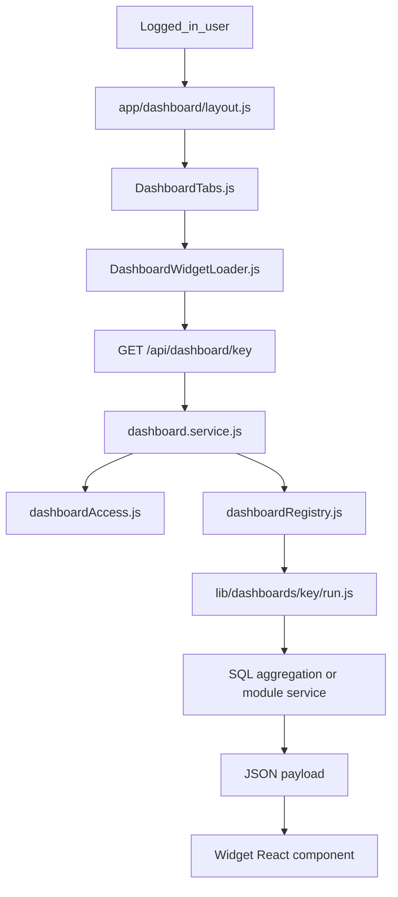

# Tarka New ERP

Tarka New ERP is a Next.js + MySQL ERP application built around configurable modules.
It is designed so business teams can create, view, edit, and track records with role-based access and audit history.

All project documentation lives in **this single file**.

---

## Table of contents

1. [Project at a glance](#1-project-at-a-glance-layman-terms)
2. [Tech stack](#2-tech-stack)
3. [High-level folder guide](#3-high-level-folder-guide)
3A. [Generic vs module-specific rule](#3a-generic-vs-module-specific-rule-very-important)
4. [Authentication & sessions](#4-authentication--sessions)
5. [Permissions & access control](#5-permissions--access-control)
5A. [Landing dashboards](#5a-landing-dashboards)
6. [Generic CRUD engine](#6-generic-crud-engine-why-it-scales)
7. [Module configuration model](#7-module-configuration-model-configmodulesjs)
7A. [Module-by-module validations](#7a-module-by-module-validations-plain-english)
8. [Lookup system](#8-lookup-system-dropdowns--picker-popups)
9. [Audit & tracking](#9-audit--tracking)
10. [New Case Inward rules](#10-major-business-rules-new-case-inward)
10A. [Accounts modules (Loan Account & Suspense)](#10a-accounts-modules-loan-account--suspense-entry)
11. [UX behaviour highlights](#11-current-ux-behavior-highlights)
12. [API routes summary](#12-api-routes-summary)
13. [Transfer Case rules](#13-module-specific-rules-transfer-case)
14. [Environment / DB / Amplify](#14-environment--db-notes)
15. [SARFAESI Case Status Update](#15-sarfaesi-case-status-update)
16. [Recommended future improvements](#16-recommended-future-improvements)
17. [Quick start](#17-quick-start)
18. [Babel/Jest sanity checklist](#18-babeljest-sanity-checklist)
- [Code comments conventions](#code-comments-conventions)
- [Reports (frozen framework)](#reports-frozen-framework)
- [Reports file index](#reports-file-index)
- [Invoice & letter PDFs](#invoice--letter-pdfs)
- [SARFAESI covering sheet PDFs](#sarfaesi-covering-sheet-pdfs)
- [Recovery Invoice PDF](#recovery-invoice-pdf)
- [SARFAESI Invoice PDF](#sarfaesi-invoice-pdf)
- [Vehicle Invoice PDF](#vehicle-invoice-pdf)
- [Return Case letter PDF](#return-case-letter-pdf)

---

## 1) Project At A Glance (Layman Terms)

- The app is made of many **modules** (Users, Branches, Cases, etc.).
- Each module has:
  - an entry form (add/edit),
  - a view table (saved records),
  - permissions (who can view/create/edit/delete).
- Most module behavior is controlled from one file: `config/modules.js`.
- Important business checks are enforced on the **server**, so they cannot be bypassed from UI.

---

## 2) Tech Stack

- **Frontend / Server framework:** Next.js 16
- **UI runtime:** React 18
- **Database:** MySQL (`mysql2`)
- **Auth password storage:** plain text in `users.password` (current project behavior)

Scripts (`package.json`):
- `npm run dev` - local development
- `npm run build` - production build
- `npm run start` - start production server

---

## 3) High-Level Folder Guide

- `config/modules.js` — module registry (tables, fields, labels, lookups) and validation summary comments
- `config/reports.js` — report definitions (filters, columns, layout)
- `config/dashboards.js` — landing dashboard widgets (titles, permission keys, layout flags)
- `config/reportExportTheme.js` — frozen HTML/Excel report styling
- `lib/` — shared server logic (RBAC, CRUD, sessions); **do not rearrange**
- `lib/modules/` — per-module business rules (`*.js`, `*Client.js`, `*Pdf.js`)
- `lib/dashboards/` — one folder per dashboard runner
- `lib/reports/` — report runners + shared report services
- `app/` — Next.js pages (`login`, `dashboard`, `dashboard/[module]`) and APIs under route groups:
  - `app/api/(auth)/`, `(platform)/`, `(dashboard)/`, `(workspace)/`, `(cases)/`, `(invoices)/`
  - Route groups organize folders only; public URLs stay `/api/...` (unchanged)
- `components/` — shared UI (forms, tables, topbar, lookups)
- `components/dashboardAlerts/` — topbar reminder/task alerts
- `components/dashboards/` — landing widgets (`shared/` + per-widget folders)
- `scripts/deploy/` — Amplify env helper (`write-amplify-env.cjs`)
- `scripts/maintenance/` — comment header helpers
- `scripts/sql/` — one-off SQL scripts
- `scripts/dev/` — local tooling (PDF debug, CSS gen, etc.)
- `amplify.yml` — Amplify build (`node scripts/deploy/write-amplify-env.cjs` then `npm run build`)
- **This `README.md`** — all operator and developer documentation

---

## 3A) Generic vs Module-Specific Rule (Very Important)

Layman version:
- Generic files are "shared machines" used by every module.
- Module files are "department rules" used by one module only.
- Do not mix them.

Project rule:
- `components/` and `lib/services/` must stay generic (no module business rules hardcoded).
- Any module-specific function/validation/helper must live in:
  - `lib/modules/<module>.js` (server/domain logic)
  - `lib/modules/<module>Client.js` (client/UI behavior)
  - optional module PDF/helper file where needed.
- `lib/services/crud.service.js` should dispatch to module adapters, not contain per-module `if` branches.

Simple test before adding code:
- "Will this apply to all modules?" -> generic file.
- "Is this only for one module?" -> that module file in `lib/modules/`.

---

## 4) Authentication & Sessions

Guide for operators and developers. Password storage is **plain text** in `users.password` by current project design (no bcrypt).

---

### 1) What happens at login

1. User submits username + password on `/login`.
2. `POST /api/auth/login` checks credentials in `lib/auth.js`.
3. Only users with **Active = Yes** may log in.
4. `createSession(userId)` in `lib/session.js`:
   - **Deletes all existing session rows** for that `user_id` (single session per user).
   - Inserts a new session id (UUID) with `expires_at` = now + idle minutes.
5. Server sets an **httpOnly** cookie named `session`.
6. Browser redirects to `/dashboard`.

---

### 2) Single session per user

If the same user signs in on another device or browser, the previous session row is removed. The old browser then gets:

- API **401** with message: *You were signed out because you signed in on another device or browser…*
- Or dashboard redirect to `/login?reason=replaced`

Reason code from `getSessionInvalidReason`: `replaced` (session id no longer in `sessions` table).

---

### 3) Idle timeout & sliding expiry

| Setting | Purpose |
|---------|---------|
| `SESSION_IDLE_MINUTES` | Server idle window (capped safely in `lib/sessionIdleMinutes.js`) |
| `NEXT_PUBLIC_SESSION_IDLE_MINUTES` | Client inactivity logout UI (`InactivityLogout`) |

On each successful `getSessionUser(sessionId)`, the server **extends** `expires_at` (sliding window). If refresh fails, the user is still returned (refresh is best-effort).

Expired sessions → reason `expired` → login message *Your session has expired…*

---

### 4) Inactive user

If `users.active` is not `Yes`, `getSessionUser` returns null even if the session row exists. Invalid reason: `inactive_user` (shown as expired-style message on login; idle logout may use `?reason=inactive`).

---

### 5) How API routes authenticate

**Do not** call `cookies()` from `next/headers` inside shared `lib/` modules — Next.js 16 + webpack can throw `cookies is not defined` and break all CRUD/LoV calls.

Correct pattern for Route Handlers:

```javascript
import { requireRequestUser } from "../../../lib/requestSession";

export async function GET(req) {
  const auth = await requireRequestUser(req);
  if (auth.unauthorized) return auth.unauthorized;
  const user = auth.user;
  // ...
}
```

`lib/requestSession.js` parses the `session` cookie from `req.headers.get("cookie")`, then calls `getSessionUser`.

Pages/layouts under `app/` may still use `cookies()` from `next/headers` directly (e.g. `app/dashboard/layout.js`).

---

### 6) Layman error messages

| Situation | Message key | Typical text |
|-----------|-------------|--------------|
| Timed out / missing cookie | `sessionExpired` | Your session has expired. Please sign in again. |
| Idle logout | `sessionInactive` | You were signed out due to inactivity… |
| Signed in elsewhere | `sessionReplaced` | You were signed out because you signed in on another device… |

Defined in `lib/apiUserMessages.js`. Built into 401 JSON by `lib/sessionAuthResponse.js`. Client-safe helpers (no DB): `lib/sessionMessages.js` (used by login page).

UI mapping: `lib/fetchClientError.js` → `resolveSessionAuthDisplayMessage`.

---

### 7) Login page & build

`/login` reads `?reason=` via `useSearchParams` inside a small `LoginReasonSync` child wrapped in **`<Suspense>`**. Without Suspense, `next build` (Amplify) fails while prerendering `/login`.

See [DEPLOY-AMPLIFY.md](#14-environment--db-notes).

---

### 8) File map

| File | Role |
|------|------|
| `lib/auth.js` | Username/password check |
| `lib/session.js` | Session CRUD, `getSessionUser`, `getSessionInvalidReason`, single-session delete |
| `lib/requestSession.js` | `requireRequestUser(req)` for APIs |
| `lib/sessionAuthResponse.js` | 401 JSON body |
| `lib/sessionMessages.js` | Client-safe reason → message (no `fs`/`db`) |
| `lib/sessionIdleMinutes.js` | Parse/clamp idle minutes |
| `app/api/(auth)/auth/login/route.js` | Login + set cookie (`POST /api/auth/login`) |
| `app/api/(auth)/auth/logout/route.js` | Clear session |
| `app/api/(auth)/auth/change-password/route.js` | Change password |
| `app/login/page.js` | Login UI + reason messages |
| `app/dashboard/layout.js` | Gate dashboard; redirect with `?reason=` |
| `components/InactivityLogout.js` | Client idle logout |

---

### 9) Tests

```bash
npx jest tests/jest/session.test.js tests/jest/requestSession.test.js tests/jest/fetchClientError.test.js --runInBand
```

---

## 5) Permissions & Access Control

The app uses two layers:

1. **Module-level permissions** (view/create/edit/delete)
   from `user_permissions` table.

2. **Row-level scope** (own / unit / all)
   controls which rows user can see/edit/delete.

Admin role (`role=1`) has broad access by design.

Key files:
- `lib/rbac.js`
- `lib/rowScope.js`
- `app/api/permissions/[module]/route.js`

---

## 5A) Landing dashboards

Dashboards are **at-a-glance summary panels** on the main `/dashboard` landing page. They show KPIs and charts without opening a full module screen. Numbers are loaded from the database when you open the page (or when you click **Refresh** on a widget).

---

### 1) What users see (plain English)

When you log in and open **Dashboard** (home), you may see one or more widgets in a grid:

| Widget | What it tells you |
|--------|-------------------|
| **Unit Wise Recovery Target** | How much recovery your unit achieved vs its FY target — donut, bank split, KPI counts, month trend |
| **My Tasks** | Your task workload by status (pending, in progress, etc.) |
| **My Reminders** | Your upcoming personal reminders |
| **Search Bank & Branch** | Quick lookup of branch codes and names across banks |
| **Invoice Collections** | FY billed vs received invoices, pending amount, by-bank share |
| **Regional Performance** | FY settled cases — summary KPIs, loan type pie, region bars |

**Full-width rows:** Unit Wise Recovery Target (four panels) and Regional Performance (three panels) span the whole row.

If you do not see a widget, an administrator must grant the matching **Dashboards** permission in **User Permissions**.

---

### 2) Permissions (who can see what)

Each dashboard has a **permission key** in `config/dashboards.js` (for example `dashboard_regional_performance`).

| Rule | Meaning |
|------|---------|
| **Admin (role 1)** | Sees all dashboards |
| **Explicit permission** | User has any access on that dashboard key in User Permissions matrix |

Dashboard permissions appear under the **Dashboards** group in the User Permissions matrix. They are **view-only** (no add/edit/delete columns).

---

### 3) How data reaches the screen



1. **Layout** checks login and builds the list of dashboards this user may see.
2. **DashboardWidgetLoader** fetches `/api/dashboard/<key>` once and caches the result in the browser. Landing widgets **stay mounted** (hidden) while module tabs are open, so closing a tab does not reload charts — only **Refresh** or a new login triggers refetch.
3. **API** checks session + permission, then calls the matching **runner** in `lib/dashboards/<key>/run.js`.
4. **Runner** loads FY bounds, unit scope, and runs SQL (or task/reminder services).
5. **Widget component** draws charts and KPI cards from the JSON.

Click **Refresh** on a widget header to force a new fetch (bypasses cache).

---

### 4) Financial year and unit scope

Many KPI dashboards use the **active financial year** from `financial_year_master` (`lib/dashboards/loadActiveFinancialYear.js`):

- Prefer the FY where today falls between `startDate` and `endDate`.
- Otherwise use the latest active FY row.

**Unit scope** (`lib/dashboards/invoice_collections/resolveUnitScope.js` — shared by Invoice Collections and Regional Performance):

| User | Data scope |
|------|------------|
| Admin | All active units |
| Unit operator (role 2+) | Only their assigned unit |
| No unit assigned | Empty widget with a friendly message |

Unit Wise Recovery Target uses similar rules inside its own `run.js`.

---

### 5) Each dashboard — data rules (developer reference)

#### Unit Wise Recovery Target

- **Folder:** `lib/dashboards/unit_wise_recovery_target/run.js`
- **UI:** `components/dashboards/unit_wise_recovery_target/UnitWiseRecoveryTargetWidget.js`
- **Achieved amount (Recovery Progress):** Same rules as **Unit Wise Cumulative** report — cases with final settled status (excluding Returned), `caseStatusUpdatedDate` in active FY, lifetime sum of `new_case_inward_amount_recovered.recoveredAmount` per case (not FY-filtered recovery dates). Bank pie groups that total by bank (no `bank.active` filter).
- **Settled Cases (FY) KPI:** Count of those settled cases with cash recovered > 0.
- **Pending Cases on Hand:** Open cases grouped by status; cases with no or blank `caseStatus` appear under **For Execution**.
- **Month chart:** Groups by **settlement month** (`caseStatusUpdatedDate`), not recovery date.

#### Invoice Collections

- **Folder:** `lib/dashboards/invoice_collections/`
- **UI:** `components/dashboards/invoice_collections/InvoiceCollectionsWidget.js`
- **Sources:** Recovery, SARFAESI, and Vehicle invoice tables (see `invoiceSources.js`).
- **KPIs:** Billed, received, outstanding, TDS, collection %, pending count/amount.
- **Right panel:** By-bank pie (share of billed amount).

#### Regional Performance

- **Folder:** `lib/dashboards/regional_performance/`
- **UI:** `components/dashboards/regional_performance/RegionalPerformanceWidget.js`
- **Cases included:** Final settled statuses (excluding Returned), `caseStatusUpdatedDate` in active FY, lifetime cash recovered > 0.
- **Panels:** Summary KPIs | loan **type** pie | RBO region bars.
- **Note:** Month chart uses **settlement date**, not recovery date — aligned with Recovery Target achieved rules.

#### Search Bank & Branch

- **Folder:** `lib/dashboards/search_bank_branch/`
- **UI:** `components/dashboards/search_bank_branch/SearchBankBranchWidget.js`
- **Search API:** `GET /api/dashboard/search-bank-branch/search?q=...`

#### My Tasks / My Reminders

- **Folders:** `lib/dashboards/my_tasks/run.js`, `lib/dashboards/my_reminders/run.js`
- **Services:** `lib/modules/taskDashboard.service.js`, `lib/modules/reminderDashboard.service.js`
- **UI:** `components/task/MyTasksWidget.js`, `components/reminder/MyRemindersWidget.js`
- **Topbar alerts:** Combined reminder + task alerts via `components/dashboardAlerts/DashboardAlertsProvider.js` (polls `/api/reminder/alerts` and `/api/task/alerts`).

---

### 6) Shared UI building blocks

| Component | Role |
|-----------|------|
| `DashboardWidgetRefreshHeader` | Title, FY subtitle, “Updated …”, refresh button |
| `DashboardSectionHeader` | Small title inside each sub-panel |
| `DashboardWidgetLoader` | Fetch, cache, skeleton, route to the right widget |
| `BankRecoveryPie` | Reusable pie chart (banks or loan types) |
| `MonthWiseRecoveryBars` | Column chart for month-wise amounts |
| `RecoveryKpiStrip` | Compact KPI list for recovery widget |

Layout CSS for four-panel widgets: `dashboard-recovery-layout` in `app/globals.css`.

---

### 7) File map (where to edit)

Each function in these files should have a short plain-English comment (what it does, when it runs). See [CODE-COMMENTS.md](#code-comments-conventions) § Inline comments.

| What you want | File |
|---------------|------|
| Add/remove a dashboard, title, permission key | `config/dashboards.js` |
| Wire runner to config key | `lib/dashboards/dashboardRegistry.js` |
| Permission logic | `lib/dashboards/dashboardAccess.js` |
| API entry point | `app/api/dashboard/[key]/route.js` |
| Landing grid + full-width slots | `components/DashboardTabs.js` |
| Map key → React widget | `components/dashboards/shared/DashboardWidgetLoader.js` |
| SQL / aggregation for one dashboard | `lib/dashboards/<key>/` |
| Widget layout and charts | `components/dashboards/<key>/` |
| User Permissions matrix rows | `lib/rbacMatrixDashboards.js` (reads config) |
| Tests | `tests/jest/dashboard*.test.js` |

Full comment conventions: [CODE-COMMENTS.md](#code-comments-conventions).

---

### 8) Adding a new dashboard (checklist)

1. Add entry to `config/dashboards.js` (`key`, `permissionKey`, `title`, `landingWidget: true`, …).
2. Create `lib/dashboards/<key>/run.js` exporting `loadDashboard(user)`.
3. Register import in `lib/dashboards/dashboardRegistry.js`.
4. Create widget under `components/dashboards/<key>/`.
5. Add branch in `components/dashboards/shared/DashboardWidgetLoader.js`.
6. If full-width, extend `DashboardTabs.js` slot class condition.
7. Add Jest test in `tests/jest/dashboard<Key>.test.js`.
8. Grant permission in User Permissions for test users.

---

### 9) API

| Route | Purpose |
|-------|---------|
| `GET /api/dashboard/<key>` | Load widget JSON (session + dashboard permission required) |
| `GET /api/dashboard/search-bank-branch/search?q=` | Branch search for Search Bank & Branch widget |
| `GET /api/dashboard/weather` | Topbar weather (not a landing widget) |

Successful response shape:

```json
{
  "ok": true,
  "key": "regional_performance",
  "financialYear": { "yearCode": "2025-26", "yearRangeLabel": "Apr 2025 – Mar 2026" },
  "...": "dashboard-specific fields"
}
```

---

### 10) Tests

Run dashboard tests:

```bash
npx jest tests/jest/dashboardRegionalPerformance.test.js
npx jest tests/jest/dashboardInvoiceCollections.test.js
npx jest tests/jest/dashboardUnitWiseRecoveryTarget.test.js
npx jest tests/jest/dashboardSearchBankBranch.test.js
npx jest tests/jest/rbacMatrixDashboards.test.js
```

Tests mock the database and verify config registration, SQL shape, and permission keys.

---

## 6) Generic CRUD Engine (Why It Scales)

Most modules run on shared CRUD handlers:

- list/create: `app/api/(platform)/crud/[module]/route.js` → `GET|POST /api/crud/:module`
- get/update/delete one record: `app/api/(platform)/crud/[module]/[id]/route.js`
- service logic: `lib/services/crud.service.js`

Shared features include:
- field validation by module config
- lookup label enrichment
- row-level permission checks
- audit stamp fields (`createdBy`, `createdDate`, etc.)
- optional child table syncing
- audit logs

---

## 7) Module Configuration Model (`config/modules.js`)

This file acts as ERP blueprint:

- module label/icon/group
- DB table name
- fields and types (`text`, `number`, `date`, `select`, `lookup`)
- required/readonly/display settings
- lookup relationships
- child table configuration

Because of this, many new modules can be added with little/no custom code.

Field-level rules (`required`, `maxToday`, `readOnly`, child `maxRows`, etc.) are defined **in this file**.
The **validation summary table** at the top of `config/modules.js` (comment block) is kept in sync with this README.

---

## 7A) Module-by-module validations (plain English)

When a user saves a record, checks run in **two layers**:

1. **Config rules** (`config/modules.js`) — required fields, date “not in the future” (`maxToday`), read-only modules, child row limits, etc. Applied by the generic CRUD service for **every** module.
2. **Custom server rules** — only for modules that have a matching file under `lib/modules/` and an entry in `lib/modules/crudModuleAdapters.js`. These run on the server so the browser cannot skip them.

**Also applies everywhere (not in modules.js):**

- **Permissions** — `user_permissions` (view/create/edit/delete + own/unit/all row scope). See §5.
- **Sessions** — inactive users cannot stay logged in.
- **Audit stamps** — `createdBy`, `createdDate`, etc. filled by the server when configured.

### Financial year freeze (many transaction modules)

If **Financial Year Master** has `freezeTransactions = Yes` for the year that contains the transaction **date**:

| Who | Behaviour |
|-----|-----------|
| **Role 2** (unit operator) | Save is **blocked** with a friendly “transactions are locked” message. |
| **Role 1** (admin) | Save is **allowed** (for corrections). |

Shared helper: `lib/modules/freezeTransactionsLock.js`.
**New Case Inward** uses a related rule on **case status update date** for **all non-admin** users (not only role 2).

### Master data modules (config rules only)

No custom `beforeWrite` adapter. Saving only enforces what you see on the form (`required`, types, lookups):

`company_master`, `employee_master`, `unit_master`, `financial_year_master`, `current_account_opening_balance`, `party_master`, `bank_master`, `current_account_master`, `ho_zo_master`, `rbo_master`, `branch_master`, `lookup_type_master`, `lookup_value_master`, `new_case_inward_transaction_control`, `case_return_reasons`, `sarfaesi_case_particulars`

| Module | Extra notes |
|--------|-------------|
| `users` | Only **Active = Yes** may log in (`lib/auth.js`). |
| `user_permissions` | Picked user must exist and be active (`userPermissions.js`). |
| `audit_logs` | **Read-only** — history is written by the app, not typed in by users. |
| `rbo_master` | Changing RBO active flag can sync linked branches (`rboMaster.js`). |

### Case workflow modules

| Module | Logic file | Main validations & side effects |
|--------|------------|----------------------------------|
| `new_case_inward` | `newCaseInward.js` | Auto **Case No** after save; loan account length/numeric/duplicate rules; final-stage edit lock; case status + recovered amount dependencies; transaction-control backdates; FY freeze on case status date (non-admin). Child: amount recovered lines. |
| `transfer_case` | `transferCase.js` | **Date = today**; case / from unit / to unit / assignee required; from unit must match case owner; to ≠ from; assignee in to-unit; **updates case owner** on save; ref `TRF/<FY>/<serial>`; FY freeze (role 2). |
| `public_notice` | `publicNotice.js` | Date required, not future; FY freeze (role 2); case required; child **max 3** rows, display name + type required; ref `PN/<FY>/<serial>`; PDF print. |
| `sarfaesi_case_status_update` | `sarfaesiCaseStatusUpdate.js` | Date required, not future; FY freeze (role 2); **SARFAESI** loan case only; **one status update per case**; ≥1 child row; particulars required (read-only in UI, preloaded); **remarks optional**; ref `SRFUP/<FY>/<####>`; case snapshot. Client: `sarfaesiCaseStatusUpdateClient.js`. Covering sheet PDFs: 13/2, 13/2 Paper Publication, 13(4) — see [SARFAESI covering sheet PDFs](#sarfaesi-covering-sheet-pdfs). |
| `return_case` | `returnCase.js` + `returnCaseClient.js` + `returnCasePdf.js` | Date required, not future; FY freeze (role 2); case must exist and be in **Returned** status; duplicate case blocked; at least one **checked** child row with return reason; ref after save; 3-page letter PDF (selected detail rows only) — see [Return Case letter PDF](#return-case-letter-pdf). |

### Accounts modules

All use FY freeze on **date** (role 2) and stamp a **voucher number** after save (patterns in each file). Unit operators are generally limited to their own unit’s accounts.

| Module | Logic file | Highlights |
|--------|------------|------------|
| `accounts_assets_investments` | `accountsAssetsInvestments.js` | Payment mode; cheque no/date if cheque; unit scope. |
| `accounts_cash_deposit_withdraw` | `accountsCashDepositWithdraw.js` | Deposit vs withdraw; NPA current account; cheque rules; unit scope. |
| `accounts_current_ac_transfer` | `accountsCurrentAcTransfer.js` | From and to current accounts must differ. |
| `accounts_expense_voucher` | `accountsExpenseVoucher.js` | Payment mode; cheque; unit scope. |
| `accounts_loan_ac` | `accountsLoanAc.js` | Receipt vs payment; cheque; unit scope; voucher `LN/CR` or `LN/DR`. |
| `accounts_suspense_entry` | `accountsSuspenseEntry.js` | Suspense voucher `SUSP/...`. |

More detail: [Accounts modules (Loan Account & Suspense)](#10a-accounts-modules-loan-account--suspense-entry).

### Printable PDFs (invoices & Return Case letter)

See [Invoice & letter PDFs](#invoice--letter-pdfs) and the per-document sections below.

| Document | Module | Download name | Section |
|----------|--------|---------------|---------|
| Recovery Invoice | `recovery_invoice` | `Invoice_<no>.pdf` | [Recovery Invoice PDF](#recovery-invoice-pdf) |
| SARFAESI Invoice | `sarfaesi_invoice` | `Invoice_<no>.pdf` | [SARFAESI Invoice PDF](#sarfaesi-invoice-pdf) |
| Vehicle Invoice | `vehicle_invoice` | `Invoice_<no>.pdf` | [Vehicle Invoice PDF](#vehicle-invoice-pdf) |
| **Return Case letter** | `return_case` | `RETURN_<refNo>.pdf` | [Return Case letter PDF](#return-case-letter-pdf) |

All use **Print** in the entry toolbar and post-save acknowledgement when `postCreateAck.showPrintPdf` is enabled in `config/modules.js`. API routes live under `app/api/<module>/pdf/[id]/route.js` (Return Case: `app/api/return-case/pdf/[id]/route.js`).

### Invoice modules (detail)

| Module | Logic file | Highlights |
|--------|------------|------------|
| `recovery_invoice` | `recoveryInvoice.js` + `recoveryInvoiceClient.js` + `recoveryInvoicePdf.js` | FY freeze (role 2); invoice number; case picker (optional case allowed); charges child; cancellation; final-invoice flag on case; 3-page PDF. View-grid status dots. |
| `sarfaesi_invoice` | `sarfaesiInvoice.js` + `sarfaesiInvoiceClient.js` + `sarfaesiInvoicePdf.js` | FY freeze (role 2); **SARFAESI** cases only; invoice number; `sarfaesi_charges` child; cancellation; 3-page PDF. View-grid status dots. |
| `vehicle_invoice` | `vehicleInvoice.js` + `vehicleInvoiceClient.js` + `vehicleInvoicePdf.js` | FY freeze (role 2); **Vehicle Loan** cases; invoice number; `vehicle_charges` child; cancellation; 3-page PDF (same layout as SARFAESI). Status dots on view grid (pending / received / cancelled). |
| `invoices_received` | `invoicesReceived.js` + `invoicesReceivedClient.js` | Record money received against Recovery / SARFAESI / Vehicle invoices; invoice pickers exclude already-linked invoices; FY freeze (role 2). |

Recovery / SARFAESI / Vehicle invoice **view grids** show status dots (yellow pending, green received, red cancelled) via per-module enrich helpers (duplicated on purpose — no shared helper).

### Where to change validations

| What you want to change | Where to edit |
|-------------------------|---------------|
| “This field is required on the form” | `config/modules.js` → module → `fields` / `childTables` |
| Business rule on save (dates, duplicates, vouchers) | `lib/modules/<module>.js` |
| Hook module into save pipeline | `lib/modules/crudModuleAdapters.js` |
| UI-only (picker filters, preload rows, read-only child field) | `lib/modules/<module>Client.js` + `components/MasterModuleClient.js` |

---

## 8) Lookup System (Dropdowns / Picker Popups)

Lookup fields can load data from other modules:

- small lists → dropdown (`LookupSelect`)
- large lists → popup picker (`LookupPicker`)

Supports:
- filtered lookup types (for `lookup_value_master`)
- missing-value merge (to show previously saved FK values)
- LOV access for create-only users via referencing-module rule (`lib/lookupLovAccess.js` — also grants LoV when the user can view a **report** that references the lookup)
- `GET /api/crud/:module?lov=1` skips row scope so dropdowns show the full reference list (still requires login + permission or referencing access)

If dropdowns show **“Options unavailable”** / “could not load the list”, check Network for `/api/crud/...?lov=1` (401 vs 500) and Amplify/server logs (`CRUD GET:`). Auth must use `requireRequestUser(req)` — see [Authentication & sessions](#4-authentication--sessions).

Key files:
- `components/LookupSelect.js`
- `components/LookupPicker.js`
- `lib/lookupLovAccess.js`
- `lib/lookupLovCache.js`
- `lib/crudLookupEnrich.js`

---

## 9) Audit & Tracking

Every create/update/delete can be logged in `audit_logs` so teams can trace:
- who changed data,
- what changed,
- when it changed.

Key files:
- `lib/audit.js`
- `lib/crudRecordAudit.js`

---

## 10) Major Business Rules: New Case Inward

`new_case_inward` has module-specific rules in:
- `lib/modules/newCaseInward.js`

Current implemented behavior includes:

- auto-case number generation based on bank prefix + loan category
- role-2 unit auto-fill/lock on new entry
- controlled field visibility (new entry vs edit mode)
- dedicated "Case Status Update" section in edit mode (separate card):
  - `caseStatus`
  - `caseStatusUpdatedDate`
  - `caseStatusRemarks`
  - `caseStatus` is optional in edit mode
  - if `caseStatus` is selected, then `caseStatusUpdatedDate` and `caseStatusRemarks` become mandatory
- date max-today validation
- bank-wise Loan Account No length validation
- Loan Account No numeric-only validation
- duplicate Loan Account No prevention with final-stage exception rules
- special handling of `Returned` status (final but not re-entry allowed)
- role-2 edit lock for final-stage rows (view-only open still allowed)
- case-status/recovered-amount dependency checks
- case-status remarks mandatory when case status is selected
- transaction-control based backdate validation before save/update:
  - `Entrustment Date` lock/unlock via control table
  - `Amount Recovered` `recoveredDate` lock/unlock via control table
  - `Case Status Update` (`caseStatusUpdatedDate`) lock/unlock via control table
  - when locked, allowed backdate days enforced server-side for changed/new values
  - matching uses exact `field_name` values from control table:
    - `Entrustment Date`
    - `Amount Recovered`
    - `Case Status Update`
  - only active controls (`is_active = 1`) are applied in UI helper/min-date fetch
- role-based date behavior for New Case Inward:
  - non-admin edit mode: `entrustmentDate` is read-only
  - `maxToday` (future-date block) is enforced for all roles in server validation
  - backdate transaction-control checks are enforced for non-admin users
- financial-year freeze behavior:
  - checks `caseStatusUpdatedDate` against `financial_year_master` (`startDate`/`endDate`)
  - if matched year has `freezeTransactions = Yes`, save is blocked for non-admin
- edit-mode legacy-data safeguard:
  - existing child row IDs are preserved in payload so unchanged old recovered rows are not treated as new edits
- child table INR formatting, right alignment, and footer totals
- New Case Inward view-grid status dot:
  - Returned -> red dot
  - Closed / Settled under Compromise / Regularized-Upgraded / Auctioned -> green dot
  - Others / blank -> yellow dot
- post-create acknowledgement modal for generated Case No (copy support; optional print slot)
- Print Case Details button (visible in view mode for selected row, and in edit mode for saved rows)
- case details PDF download with filename: `CASE_DETAILS_<caseNo>.pdf`
- Print Branch Copy flow:
  - acknowledgement button label: `Print Branch Copy`
  - dedicated API and dedicated PDF builder (separate from Case Details PDF)
  - available in NCI view selection and edit mode action area

---

## 10A) Accounts modules: Loan Account & Suspense Entry

This note is for anyone using or supporting the ERP, not only developers. It explains **what these screens do**, **how voucher numbers work**, and **what users should expect**.

---

### Loan Account (`accounts_loan_ac`)

#### What is this screen for?

Use **Loan Account** to record money **received from** or **paid toward** loan-related activity. You pick the **unit**, **date**, **transaction type** (money in = **Receipt**, money out = **Payment**), **party**, how it was paid (**payment mode**), and the **amount**, with remarks and optional cheque details when needed.

#### Voucher number (automatic reference)

When you save a **new** row, the system assigns a **Voucher No.** You do not type it on first save; it appears after save and in the confirmation popup.

- **Receipt** transactions get numbers like: `LN/CR/<financial year code>/0001`, `0002`, …  
- **Payment** transactions get numbers like: `LN/DR/<financial year code>/0001`, `0002`, …  

The **financial year code** comes from the **date** you entered (the system looks up which financial year that date falls in).

Receipts and payments each have their **own running counter** per year (so a Receipt and a Payment can both be “number 1” in the same year — they use different prefixes: **CR** vs **DR**).

#### Checks applied when saving

Before the record is written, the server checks things like: transaction type and payment mode are valid; **cash** vs **bank/UPI/card** rules around the **NPA Current AC** field; cheque number and date when payment mode is cheque; and (for certain user roles) that the **unit** and current account choices match the user’s permissions. If something is wrong, you get a clear error instead of a half-saved record.

#### After you save

If configured, a small **“saved”** message can show the new **Voucher No.** so you can note it or continue with another entry.

#### One UI detail (operators with a fixed unit)

For some users, the data entry form **fills unit and NPA current account** automatically from the user’s unit. **NPA Current AC remains selectable** in the dropdown (unit is still read-only). The list is filtered to accounts for that unit (`f_unit`). Server validation still requires the chosen NPA account to belong to the user’s unit. Switching **payment mode to Cash** only clears the **NPA Current AC** field as intended — it should **not** wipe the rest of the form (party, amount, etc.).

---

### Suspense Entry (`accounts_suspense_entry`)

#### What is this screen for?

Use **Suspense Entry** for bookkeeping entries that need to go through a **suspense** account path. You enter **date**, **transaction type** (Debit/Credit as per your configuration), **NPA Current AC**, **remarks**, and **amount**. Field-level rules follow `config/modules.js` (required flags, etc.).

#### Voucher number (automatic reference)

On first save, the system assigns:

`SUSP/<financial year code>/0001`, `0002`, … (four digits)

Again, the **year code** comes from the **date** via the financial year master table. There are **no extra custom server validations** in the suspense module beyond normal required fields — the main “special” behaviour is **stamping the voucher** in the same database transaction as the insert.

#### After you save

The **post-save acknowledgement** uses the same pattern as other account screens: the UI reads `postCreateAck` from module config and shows the new **Voucher No.** when the API returns it.

---

### Where the code lives (for developers)

| Area | Location |
|------|-----------|
| Loan Account — server rules & voucher stamp | `lib/modules/accountsLoanAc.js` |
| Loan Account — browser helpers (unit/NPA behaviour) | `lib/modules/accountsLoanAcClient.js` |
| Suspense Entry — voucher stamp only | `lib/modules/accountsSuspenseEntry.js` |
| Runs voucher stamping after INSERT | `lib/moduleAfterCreate.js` |
| Screen layout & fields | `config/modules.js` |

---

### Database expectations

- Tables **`accounts_loan_ac`** and **`accounts_suspense_entry`** must exist with columns declared in `config/modules.js` (including **`date`**, **`voucherNo`** where applicable).
- Running voucher numbers use the shared **`module_number_sequence`** table, one row per **module + prefix** (e.g. per financial year prefix).

---

### Tests

Automated tests for voucher stamping and core validation helpers live under `tests/jest/` (see `accountsLoanAc.test.js`, `accountsSuspenseEntry.test.js`).

---

## 11) Current UX Behavior Highlights

- Large validation/error toast appears at top-center for readability.
- Error toast stays longer than success toast.
- Numbers in key forms are shown in INR-style grouping.
- Required `*` marker is shown in entry forms only (hidden in view tables).
- New Case Inward entry shows helper hints for backdate policy (based on transaction control setup).
- Child table totals show `₹` and highlighted footer band.
- Audit Logs screen is simplified for administrators:
  - no row checkbox/edit/delete controls
  - technical `record_id` hidden from view table
  - single "Compare" button per row for old/new data
  - compact JSON preview in table cells
  - compare modal shows side-by-side values with changed rows highlighted
  - date fields in compare modal are shown in readable `dd-mm-yyyy` / `dd-mm-yyyy HH:mm`
- New Case Inward case-details PDF follows a report layout (A4):
  - logo + title + case reference header
  - single-column key detail rows
  - case status/remarks table
  - amount recovered table with total
  - status mark (returned/final/in-progress) drawn as vector
  - printed date shown near report end
- Transfer Case entry behavior:
  - `date` is strictly today only (both UI and server enforce this)
  - selecting `caseNo` auto-loads current owner into `fromUnit` (read-only)
  - `toUnit` list excludes selected `fromUnit`
  - `assignee` list loads only users mapped to selected `toUnit`
  - assignee dropdown shows `No matching records` when filter returns no rows
  - picker modal width auto-expands based on number of configured columns
- Public Notice entry behavior:
  - selecting `caseNo` loads a case snapshot from `new_case_inward`
  - snapshot is shown inside an inline collapsible card (`Show` / `Hide`) below the form
  - this snapshot behavior is module-specific to `public_notice` and does not affect generic module rendering
  - after **create or update**, an acknowledgement modal shows `refNo` with **Continue** and **Print Public Notice** only (no Copy); print uses `GET /api/public-notice/pdf/:id`
  - in **view** mode, with a row selected, **Print Public Notice** appears in the toolbar; the same button appears in entry mode when editing a saved row

---

## 12) API Routes Summary

Most protected routes use `const auth = await requireRequestUser(req);` then `auth.user` / `auth.unauthorized`.

- `POST /api/auth/login` - login (sets `session` cookie)
- `POST /api/auth/logout` - logout
- `POST /api/auth/change-password` - change password for logged-in user
- `GET /api/health/db` - DB connectivity check for operators/deploys (no secrets)
- `GET /api/permissions/:module` - module permissions for logged-in user
- `GET|POST /api/crud/:module` - list/create (`?lov=1` for dropdowns)
- `GET|PUT|DELETE /api/crud/:module/:id` - one-record operations
- `GET|POST /api/user-permissions-matrix` - permission matrix UI backend
- `GET /api/dashboard/<key>` - landing widget KPI JSON; see [Landing dashboards](#5a-landing-dashboards)
- `GET /api/dashboard/search-bank-branch/search?q=` - branch search widget
- `GET /api/dashboard/weather` - topbar weather
- `GET /api/reports/:reportKey/run?format=html|excel&...` - run report; see [Reports](#reports-frozen-framework)
- `GET /api/new-case-inward/loan-account-rule?branchId=` - branch→bank loan rule
- `GET /api/new-case-inward/case-details-pdf/:id` - Case Details PDF
- `GET /api/new-case-inward/branch-copy-pdf/:id` - Branch Copy PDF
- `GET /api/new-case-inward/transaction-control` - NCI date-picker control rows
- `GET /api/new-case-inward/entry-lookups` - NCI entry lookup helpers
- `GET /api/public-notice/pdf/:id` - Public Notice PDF
- `GET /api/return-case/pdf/:id` - Return Case letter PDF
- `GET /api/sarfaesi-case-status-update/covering-132-pdf/:id` - 13(2) Covering Sheet PDF
- `GET /api/sarfaesi-case-status-update/covering-132-paper-publication-pdf/:id` - 13(2) Paper Publication covering PDF
- `GET /api/sarfaesi-case-status-update/covering-134-pdf/:id` - 13(4) Covering Sheet PDF
- `GET /api/return-case/return-reasons` - preload return reasons (gated on `return_case`)
- `GET /api/return-case/cc-to` - CC To helper
- `GET /api/recovery-invoice/pdf/:id` / `sarfaesi-invoice` / `vehicle-invoice` - invoice PDFs
- `GET /api/invoice/case-snapshot/:caseId` / `invoice-snapshot/...` / `npa-current-ac` - invoice entry helpers
- `GET|POST /api/task` / `GET|PATCH /api/task/:id` / `GET /api/task/alerts` - My Tasks
- `GET|POST /api/reminder` / `GET|PATCH /api/reminder/:id` / `GET /api/reminder/alerts` - My Reminders
- `GET /api/audit-logs/enrich-compare` - audit compare labels

Generic CRUD lookup (`GET /api/crud/:module?lov=1`) supports:
- `exclude_id=<id>` - removes one row id from LoV results (e.g. Transfer Case `toUnit`)
- numeric lookup filters like `f_unit=<id>` as exact FK matching (e.g. Transfer Case `assignee`)
- `filterLookupTypeName` / `filterLookupType` for `lookup_value_master`

---

## 13) Module-Specific Rules: Transfer Case

`transfer_case` custom server logic is in:
- `lib/modules/transferCase.js`

Implemented behavior:
- strict validation before write:
  - `date` must be today
  - `caseNo`, `fromUnit`, `toUnit`, `assignee` are required
  - selected `caseNo` must exist in `new_case_inward`
  - `fromUnit` must match current case owner unit
  - `toUnit` must differ from `fromUnit`
  - `assignee` must belong to selected `toUnit`
- on save, linked `new_case_inward` row is updated:
  - `unit = toUnit`
  - `createdBy = assignee`
  - `modifiedBy = assignee`
- auto-generated Ref No format:
  - `TRF/<yearCode>/<runningSerial>`
  - `<yearCode>` resolved from `financial_year_master` using transfer date
  - running serial maintained in `module_number_sequence` with transaction-safe locking
- audit behavior:
  - normal audit entry for `transfer_case` create/update
  - additional audit entry for linked `new_case_inward` ownership update (with old/new snapshot)

---

## 14) Environment / DB Notes

Set standard DB env vars for `lib/db.js`:
- `DB_HOST`
- `DB_USER`
- `DB_PASS`
- `DB_NAME`
- `DB_PORT` (optional if default)
- Optional SSL: `DB_SSL`, `DB_SSL_CA` / `DB_SSL_CA_PEM`, `DB_SSL_REJECT_UNAUTHORIZED`
- Optional pool: `DB_POOL_LIMIT` (default 5)

Optional session behavior:
- `SESSION_IDLE_MINUTES`
- `NEXT_PUBLIC_SESSION_IDLE_MINUTES` (client idle logout UI)

Ensure MySQL tables used by configured modules exist and column names match config.

### AWS Amplify Hosting (full guide)

This app is a Next.js SSR app hosted on Amplify Hosting. Build config lives in the repo root: `amplify.yml`.

---

### 1) Build pipeline

```text
npm ci
node scripts/deploy/write-amplify-env.cjs   → writes .env.production from Amplify env
npm run build                       → next build
```

Artifacts: `.next/**`

Amplify console environment variables are **not** automatically available to Next.js SSR at runtime unless copied into `.env.production` at build time (see AWS SSR env docs). That is what `scripts/deploy/write-amplify-env.cjs` does.

---

### 2) Required environment variables

Set these in **Amplify → App settings → Environment variables** for the branch:

| Variable | Required | Notes |
|----------|----------|--------|
| `DB_HOST` | Yes | RDS hostname (not `localhost` in production) |
| `DB_USER` | Yes | |
| `DB_PASS` | Yes | Special characters are JSON-escaped by the write script |
| `DB_NAME` | Yes | |
| `DB_PORT` | Optional | Default 3306 |
| `DB_SSL` | Often Yes for RDS | `true` / `1` / `yes` |
| `DB_SSL_CA` / `DB_SSL_CA_PEM` | Optional | CA bundle path or PEM text |
| `DB_SSL_REJECT_UNAUTHORIZED` | Optional | |
| `DB_POOL_LIMIT` | Optional | Default 5 |
| `SESSION_IDLE_MINUTES` | Optional | Server session idle |
| `NEXT_PUBLIC_SESSION_IDLE_MINUTES` | Optional | Client idle logout |

After changing env vars, trigger a **full redeploy** (rebuild), not only a restart.

Build log should show something like:

```text
[write-amplify-env] Wrote N variable(s) to .env.production: DB_HOST, DB_USER, ...
```

If it says `(none — set DB_* in Amplify console)`, login and CRUD will fail.

---

### 3) Health check after deploy

Open:

```text
https://<your-domain>/api/health/db
```

Expect `{ "ok": true }` or `{ "ok": false, "hint": "..." }` with a safe operator hint (no passwords).

---

### 4) Common build failures

#### A) `useSearchParams() should be wrapped in a suspense boundary` on `/login`

**Cause:** Login page reads `?reason=` with `useSearchParams` without Suspense.  
**Fix:** Keep `LoginReasonSync` inside `<Suspense>` in `app/login/page.js` (already in main).  
**Verify locally:** `npm run build` must list `○ /login` without prerender error.

Jest does **not** catch this — only `next build` does.

#### B) `Module not found: Can't resolve 'fs'` via `lib/db.js` → client page

**Cause:** A `"use client"` file imported server-only code (`lib/session.js` → `lib/db.js`).  
**Fix:** Client pages import message helpers from `lib/sessionMessages.js` only.

#### C) `cookies is not defined` at runtime (CRUD / dropdowns)

**Cause:** `cookies()` from `next/headers` called from `lib/requestSession.js`.  
**Fix:** Use `requireRequestUser(req)` and parse the Cookie header — see [AUTH-SESSIONS.md](#4-authentication--sessions).

#### D) Cache warning `Unable to write cache: 404`

Usually harmless Amplify cache noise; not the root cause of a failed `next build`.

---

### 5) Local parity checklist before push

```bash
npm run build
npm test -- --runInBand   # optional but recommended
git status                # clean working tree
git push                  # Amplify builds the new commit
```

Confirm Amplify build log **Switching to commit:** matches your latest `git log -1` hash.

---

### 6) Related files

| File | Role |
|------|------|
| `amplify.yml` | Amplify phases |
| `scripts/deploy/write-amplify-env.cjs` | Env → `.env.production` |
| `app/api/health/db/route.js` | Connectivity probe |
| `lib/db.js` | Pool + SSL |
| `lib/dbConnectionError.js` | Operator-facing hints |
| [AUTH-SESSIONS.md](#4-authentication--sessions) | Session / login behaviour |
| [README.md](#tarka-new-erp) §14 | Env overview |

---

## 15) SARFAESI Case Status Update

Module key: `sarfaesi_case_status_update`
Server: `lib/modules/sarfaesiCaseStatusUpdate.js`
Client: `lib/modules/sarfaesiCaseStatusUpdateClient.js`

**Purpose:** Record SARFAESI case checklist status — one row per case, with child lines for each active particular from **SARFAESI Case Particulars** master.

**Validations:**

- Parent **date** — required; cannot be in the future; FY freeze for role 2.
- **Case No** — required; must be SARFAESI loan category; cannot already exist on another status-update record (edit excludes current row).
- **Child details** — at least one row; each row needs **particulars** (active master record); **remarks** optional.
- **Ref No** — auto `SRFUP/<financial year code>/<4-digit serial>` after create.

**UI:**

- New entry preloads all active particulars (sorted by sequence); particulars column is read-only; remarks editable.
- Case snapshot (like Public Notice / Return Case).
- Post-create acknowledgement shows ref no (no print button in config — `showPrintPdf: false`).
- **Print buttons** (view-row select + edit toolbar only):
  - **Print 13/2 Covering Sheet**
  - **Print 13/2 Paper Publication**
  - **Print 13(4) Covering Sheet**  
  Details: [SARFAESI covering sheet PDFs](#sarfaesi-covering-sheet-pdfs).

---

## 16) Recommended Future Improvements

- Add automated tests for remaining module-specific business rules
- Move more hardcoded status policies to config for easier ops control
- Add migration/versioning discipline for schema changes
- Keep `config/modules.js` validation comment table aligned when adding modules
- Consider password hashing if security policy requires it (currently plain text by design)

---

## 17) Quick Start

1. Install dependencies: `npm install`
2. Create `.env.local` with `DB_*` (and optional `SESSION_IDLE_MINUTES` / `NEXT_PUBLIC_SESSION_IDLE_MINUTES`). See §14 Environment / DB Notes.
3. Run: `npm run dev`
4. Login with an **Active = Yes** user and open the dashboard
5. Before production push: `npm run build` (must succeed) and optionally `npm test -- --runInBand`

---

## 18) Babel/Jest Sanity Checklist

When changing test/build config, quickly verify both app runtime and tests still work:

1. Check `babel.config.js` has environment split:
   - `test` env -> `@babel/preset-env` (Node/Jest)
   - non-test env -> `next/babel` (Next.js + JSX)
2. Run Jest once:
   - `npm test -- --runInBand`
3. Run Next dev once:
   - `npm run dev`
4. If you see JSX parse errors (`experimental syntax 'jsx'`), confirm non-test env is using `next/babel`.
5. If needed, inspect effective Babel config:
   - `npx cross-env BABEL_SHOW_CONFIG_FOR=app/layout.js npm run dev`

---

## Code comments conventions

This ERP uses **layman-friendly file headers** so anyone opening a file can tell what it does without reading the whole file.

---

### What every source file should have

At the **top of the file** (after `"use client";` on React components):

1. **Category line** (optional but common) — one `//` line saying *what kind of file* this is.
2. **`/** … */` block** — 2–6 lines in plain English: purpose, who uses it, where related logic lives.

Example (`lib/modules/returnCase.js`):

```javascript
// Module-specific server rules — validations and side effects on save.

/**
 * Return Case — server-side save rules (runs before data is written to the database).
 * Case must be in “Returned” status; at least one checked return reason.
 * PDF letter: lib/modules/returnCasePdf.js — README.md#return-case-letter-pdf
 */
```

---

### Category lines by folder

| Folder | Typical first line |
|--------|-------------------|
| `app/api/**/route.js` | `// Application API route — …` |
| `app/**/page.js`, `layout.js` | `// Application page or layout — …` |
| `components/*.js` | `// Generic/shared file used across modules.` |
| `lib/*.js` | `// Shared library helper for reusable application logic.` |
| `lib/modules/*.js` | `// Module-specific server rules — …` |
| `lib/modules/*Client.js` | `// Module-specific browser helpers — …` |
| `lib/modules/*Pdf.js` | `// Module PDF layout — draws printable pages (pdfkit).` |
| `lib/services/*.js` | `// Shared service — database operations used by many API routes.` |
| `config/*.js` | `// Configuration — defines modules, fields, and dashboard layout.` |
| `config/reports.js` | `// Configuration — report screens (filters, columns, layout).` |
| `config/reportExportTheme.js` | `// Frozen HTML + Excel export styling for all reports.` |
| `lib/reports/*.js` | `// Shared report helper — …` or `// Report — <name>. …` |
| `lib/reports/custom/**` | `// Excel — <report name> (custom visual layout).` |
| `components/Report*.js` | `// Report UI — …` (after `"use client";`) |
| `components/reports/*.js` | `// Custom report table body — …` |
| `app/api/reports/**/route.js` | `// Application API route — run report (HTML JSON or Excel download).` |
| `config/dashboards.js` | `// Configuration — landing dashboard widgets (titles, permission keys).` |
| `lib/dashboards/**/run.js` | `// Dashboard — <name> (server loader for landing widget).` |
| `lib/dashboards/**/*.js` | `// Dashboard — …` (SQL aggregation or shared FY/unit scope). |
| `components/dashboards/**` | `// Dashboard widget UI — …` (after `"use client";`) |
| `app/api/dashboard/**/route.js` | `// Application API route — dashboard KPI JSON for landing widgets.` |
| `tests/jest/dashboard*.test.js` | `// Test file — dashboard config, SQL, and permission checks.` |
| `tests/jest/*.test.js` | `// Test file — automated checks so changes do not break existing behaviour.` |

---

### What to write inside `/** … */`

- **What** the file does (one sentence a non-developer could understand).
- **Who calls it** (browser, API, save pipeline, Print button).
- **Where to look next** (e.g. `config/modules.js`, `README.md#return-case-letter-pdf`, paired `*Client.js` file).

Avoid repeating the file name only. Prefer:

- Good: “Converts rupee amounts to words for invoice PDFs.”
- Weak: “amountInWords.js — utility.”

---

### Inline comments (inside functions)

Every **non-trivial function** should have short `//` comments so a reader can scan the file without reading every line.

#### Where to comment

| Location | What to write |
|----------|----------------|
| Start of exported function | One line: what it does and when it runs (e.g. “Runs before save — blocks duplicate case.”) |
| Long API `GET`/`POST` | Section markers: login check, load parent, load child rows, build PDF, return response |
| Save validators | Each rule block: date, FY freeze, child rows, ref/voucher number |
| PDF builders | Logo, headers, body, tables, sign-off, footer |
| React handlers | What the button/modal does for the user |
| `useEffect` | Why it runs (preload, idle logout, fetch on mount) |

#### What to skip

- Obvious one-liners (`return null`, `i++`)
- Every `expect()` in tests — comment the **describe** / tricky mock setup instead
- Repeating the function name without adding meaning

#### Example (API route)

```javascript
export async function GET(req, { params }) {
  // Must be logged in — PDF routes never work for anonymous users.
  const auth = await requireRequestUser(req);
  if (auth.unauthorized) return auth.unauthorized;
  const user = auth.user;

  // Load Return Case + checked detail rows from the database.
  const result = await getCrudRecordById(user, "return_case", id);
  ...
}
```

Session helpers: [AUTH-SESSIONS.md](#4-authentication--sessions). Amplify deploy: [DEPLOY-AMPLIFY.md](#14-environment--db-notes).
---

| Kind of logic | File |
|---------------|------|
| Field required on form | `config/modules.js` |
| Report filters, columns, layout | `config/reports.js` |
| Report SQL + `runReport` | `lib/reports/<report_key>.js` |
| Report pipeline (auth, Excel/HTML) | `lib/reports/report.service.js` |
| Frozen report theme (fonts, logo) | `config/reportExportTheme.js` |
| Custom report table HTML | `components/reports/<Name>.js` |
| Save validation / voucher numbers | `lib/modules/<module>.js` |
| Pickers, Print, preload child rows | `lib/modules/<module>Client.js` |
| PDF layout | `lib/modules/<module>Pdf.js` |
| Generic UI (forms, tables) | `components/` — **no** module business rules |
| Landing dashboard widgets | `config/dashboards.js`, `lib/dashboards/`, `components/dashboards/` — [DASHBOARDS.md](#5a-landing-dashboards) |

Report styling and pipeline rules: [README.md#reports-frozen-framework](#reports-frozen-framework).

See README §3A “Generic vs Module-Specific Rule”.

---

### Maintenance scripts

| Script | Purpose |
|--------|---------|
| `scripts/maintenance/add-layman-file-headers.cjs` | Add missing headers on files that start with neither `//` nor `/**` (after `"use client"`). Review the diff — do not run blindly on a dirty tree. |
| `scripts/maintenance/strip-duplicate-layman-headers.cjs` | Remove a **generic** prepended header when a richer original `/**` block follows (recovery after a bad header pass). |
| `scripts/maintenance/dedupe-layman-headers.cjs` | Older helper: remove shallow duplicate `/**` when a richer block follows |
| `scripts/maintenance/strip-generic-header-lines.cjs` | Remove leftover generic one-liners |

**Important:** `add-layman-file-headers.cjs` treats either a leading `//` category line **or** a `/**` block as “already documented”, so it will not stack a second generic header on top of existing docs.

After running these, always review `git diff` — automated headers are a starting point, not a substitute for accurate descriptions on important files.

---

### Operator-facing docs

For **Print / PDF** behaviour aimed at staff and support, use `README.md` (e.g. [return-case-pdf.md](#return-case-letter-pdf), [invoices-pdf.md](#invoice--letter-pdfs), [sarfaesi-covering-sheet-pdf.md](#sarfaesi-covering-sheet-pdfs), [recovery-invoice-pdf.md](#recovery-invoice-pdf), [sarfaesi-invoice-pdf.md](#sarfaesi-invoice-pdf), [vehicle-invoice-pdf.md](#vehicle-invoice-pdf)) and link from README. Each `*InvoicePdf.js` / covering-sheet PDF module has a file header, section markers, and JSDoc on draw/export helpers — keep those comments when changing layout.

---

## Reports (frozen framework)

Read-only reports are defined in **`config/reports.js`** — not in `config/modules.js`.

**File index:** [REPORTS-FILES.md](#reports-file-index) lists every report-related path. **Code comments:** [CODE-COMMENTS.md](#code-comments-conventions) § `lib/reports`.

### Frozen framework (v1)

**Status:** **Locked — June 2026.** Validated on **New Case Inward Register** and **Branch Register**. Do not change shared styling, HTML layout, or export appearance without updating this document and the frozen theme tests.

#### What is frozen (do not change per report)

| Layer | Files | Role |
|-------|-------|------|
| **Theme** | `config/reportExportTheme.js` | Fonts, colours, zebra, logo, Excel layout, HTML font presets |
| **Theme merge** | `lib/reports/applyReportExportTheme.js` | Merges theme into each report config |
| **Pipeline** | `lib/reports/report.service.js` | Auth, validation, SQL run, column visibility, totals, HTML/Excel |
| **HTML render** | `components/ReportOutputView.js` | Table, header, filter summary, footer, font toolbar |
| **HTML CSS** | `app/globals.css` (`.report-output*`) | Layout, wrapping, sticky header, scroll, dark/light rows, toolbar |
| **Column widths** | `lib/reports/htmlColumnWidths.js` | `widthHtml` → proportional `%` |
| **Column hide** | `lib/reports/resolveVisibleReportColumns.js` | `hideWhenFilterSet` when filter selected |
| **Excel build** | `lib/reports/buildReportWorkbook.js` | Logo, borders, zebra, totals row |
| **Excel logo** | `lib/reports/addReportExcelLogo.js` | Fixed pixel logo (`logoExtWidth` / `logoExtHeight`) — not stretched by column widths |
| **Custom HTML** | `components/ReportCustomOutputView.js`, `components/reports/*.js` | Opt-in bespoke layouts only |
| **Filter summary** | `lib/reports/buildFilterSummary.js`, `resolveReportFilterLabels.js` | Selected filters only, display labels |
| **UI shell** | `components/ReportModuleClient.js` | Filter form + generate; role-2 Unit lock on case report keys |

#### What each new report adds (only)

1. Entry in **`config/reports.js`** — `fields`, `columns`, optional `reportLayout.title`, `reportStyle.totalRow.labelColumn`, `filterCascade`, `hideWhenFilterSet` on columns
2. **`lib/reports/<report_key>.js`** — `runReport(user, filters, ctx)` with all SQL / `buildWhere` for that report
3. Register in **`lib/reports/reportRegistry.js`**
4. **`can_view`** in User Permissions

Do **not** duplicate styling, column-picker UI, or export logic in per-report files.

#### Report dimension filters (unit and hierarchy)

Optional header filters apply **only when the user selects them** in the report form (admin / role 1). If Unit is left empty, the query does **not** filter by unit (all units). When Unit is selected, case-based reports use **`nci.unit`** on `new_case_inward` via `lib/reports/nciReportDimensionFilters.js`. Account ledgers use that module’s voucher `unit` column the same way (filter-only).

**Role 2 (unit operators):** on the nine case-related report keys listed in `lib/reports/reportUnitFilterLock.js`, Unit is auto-filled from the session unit, disabled in the filter form, and forced on the server when the report runs. Accounts and other reports are unchanged — Unit stays optional. Admin (role 1) can still pick any unit.

Report filter LoVs load through `GET /api/crud/<master>?lov=1` (same auth as other screens). If options fail to load, see [AUTH-SESSIONS.md](#4-authentication--sessions).

#### Pipeline (fixed)

```
ReportModuleClient → GET /api/reports/<key>/run
  → report.service.js
      → validate filters
      → runner.runReport (SQL)
      → resolveVisibleReportColumns
      → computeReportTotals
      → buildFilterSummaryText
      → HTML JSON  |  buildReportWorkbook (Excel)
  → ReportOutputView (HTML only)
```

HTML and Excel always receive the **same** visible column list and totals.

#### Intentionally not in scope

- Manual column show/hide UI
- Drag-to-resize columns
- localStorage / saved layouts
- Client-only column hiding
- Content-based auto column widths

#### Current theme snapshot (v1 — frozen)

**Theme object** (`config/reportExportTheme.js` → `REPORT_EXPORT_THEME`):

**HTML fonts** (`html` / `htmlFontPresets` — toolbar switches preset, Excel unchanged):

| Preset | Toolbar | Table body | Title | Filter line |
|--------|---------|------------|-------|-------------|
| `small` | A− | `calc(0.65rem - 1pt)` | `calc(1.15rem - 1pt)` | `calc(0.85rem - 1pt)` |
| `normal` (default) | A | `calc(0.75rem - 1pt)` | `calc(1.25rem - 1pt)` | `calc(0.95rem - 1pt)` |
| `large` | A+ | `calc(0.85rem - 1pt)` | `calc(1.35rem - 1pt)` | `calc(1.05rem - 1pt)` |

- Table header: `calc(0.7rem)` (normal preset); footer/totals: `calc(0.75rem)` (normal preset)
- A− (`small`) uses former default A sizes (`0.65rem` table); default A uses former A+ sizes (`0.75rem`)
- Logo max height: `58px`; scroll area: `min(78vh, 40rem)`; mobile horizontal scroll: ≤1024px

**HTML layout & colours** (`app/globals.css` `.report-output*` — do not scatter report styles elsewhere):

- Card uses app theme (`var(--panel)`, `var(--text)`) — not forced white in dark mode
- **Light (enterprise v2):** zebra `#ffffff` / `#f0f4f8`; header band `#9db7c8` (black labels); totals `#9fd4ad` with top border
- **Dark:** CSS vars — subtle brand-tinted zebra, header, and totals on `var(--panel)`
- **Line-height:** `1.5` body; `1.45` header (denser rows)
- **Borders:** horizontal row lines only (no vertical grid in body); sticky header with stronger bottom edge
- **Table:** `width: 100%`, `table-layout: fixed`, sticky header, hidden scrollbars, cell wrap; INR/number columns use `nowrap` (horizontal scroll on narrow viewports)
- **Font toolbar:** top-right of report card when rows present — **A− / A / A+** (session-only; min/max disabled)
- **Filter panel:** remains visible after Generate; use **Generate** again to refresh output with changed filters
- **Dates:** all report date columns, filter summary dates, and Excel export use **DD-MM-YYYY** (`lib/formatReportDateDisplay.js`)
- **Output meta:** filters left and `Generated: DD-MM-YYYY, HH:mm · N records` right on one row; centered reports (`contentAlign: center`) stack filter summary and generated meta on separate lines
- **Loading:** skeleton placeholder in the output area while HTML runs (Excel still uses overlay)
- **Table scroll:** hidden scrollbar; animated down-chevron while more rows below; animated up-chevron at bottom (click scrolls to top)
- **Full screen:** toolbar **⛶** shows table only (font controls + data); **✕** or **Esc** to exit
- **Cell padding:** `0.28rem 0.55rem` on table body cells (standard and custom flat tables)

**Excel** (`reportExportTheme.excel`):

- Table: 9pt; title 12pt; filter 10pt
- Logo: 2 rows `[34, 24]` height (title starts row 3); fixed size `logoExtWidth: 396`, `logoExtHeight: 58` pixels via `addReportExcelLogo.js` (`editAs: absolute` — immune to later column width changes)
- No gridlines; header/footer borders; vertical lines on data columns
- **Wrap text** on filter summary, column headers, text data cells, and totals row; INR/number cells omit wrap (`buildReportWorkbook.js`)
- Zebra / totals: `#ffffff` / `#F0F4F8`; header `#9DB7C8`; total row `#9FD4AD`

#### Changing frozen styling

1. Edit **`config/reportExportTheme.js`** and/or **`app/globals.css`** (`.report-output*` only).
2. Update this section’s snapshot and **`tests/jest/reportExportTheme.test.js`** (theme contract).
3. Re-check HTML on **both** light and dark app theme and Excel export on a reference report.
4. Do **not** add per-report CSS or inline report colours in `ReportOutputView` or report SQL files.

Per-report **`config/reports.js`** overrides remain limited to: `reportLayout.title`, `reportStyle.totalRow` / `sectionTotalRow`, column defs, filters.

**Grouped standard tables** (e.g. Expense Ledger Payment Mode Wise): runner returns `outputMode: "grouped"` with `groupedSections` + `grandTotal`; `ReportOutputView` and `buildReportWorkbook` render section headers and subtotals without `reportLayout.mode: custom`.

---

### Frozen export theme (HTML + Excel)

Shared styling lives in **`config/reportExportTheme.js`**. Individual report files must not set fonts, colours, borders, or layout rules — only the frozen theme and `.report-output*` CSS.

- **HTML:** `ReportOutputView` applies CSS variables from `getReportHtmlCssVars(preset)`; all visual rules in `app/globals.css` under `.report-output*`.
- **HTML font toolbar:** After generate, use **A− / A / A+** (top-right) to switch `htmlFontPresets` (`small`, `normal`, `large`). **A** is default (former A+ size); **A+** is the new largest step. Client-only, session state — does not re-run the report or affect Excel.
- **Excel:** `lib/reports/buildReportWorkbook.js` reads `exportTheme.excel` (merged via `getReportConfig()`).
- **Per-report overrides** in `config/reports.js`: only report-specific items (e.g. `reportLayout.title`, `reportStyle.totalRow.labelColumn`). Logo path and zebra colours come from the theme unless explicitly overridden.

### Adding a report

1. Add an entry to **`config/reports.js`** (`fields`, `columns`, optional `reportLayout` / `reportStyle` overrides, optional `filterCascade`).
2. Create **`lib/reports/<report_key>.js`** with `runReport(user, filters, ctx)` — all SQL and `buildWhere` logic in that file only.
3. Register the file in **`lib/reports/reportRegistry.js`**.
4. Grant **`can_view`** on the report key in User Permissions.

### Custom-layout reports (thin opt-in)

Use only when the frozen table pipeline cannot represent the layout (e.g. merged region rows, banded subtotals). **Not** a generic framework — one bespoke report at a time.

#### Config

- `reportLayout.mode: "custom"`
- `reportLayout.customRenderer` — id mapped in `lib/reports/customRendererMap.js` and `components/ReportCustomOutputView.js`
- No `columns` / `reportStyle` — runner returns `{ layout: "custom", custom: { ... } }` instead of `rows`

#### Runner

- **`lib/reports/<report_key>.js`** — `runReport` returns custom payload; optional `buildCustomWorkbook` export for Excel
- Per-report Excel builder under **`lib/reports/custom/<report_key>/buildCustomWorkbook.js`** when needed

#### Pipeline branch (`report.service.js`)

When `reportLayout.mode === "custom"` (or runner returns `layout: "custom"`):

- Skips `resolveVisibleReportColumns`, `computeReportTotals`, `buildReportWorkbook`
- **HTML** — JSON with `layout`, `customRenderer`, `custom`, `filterSummary`
- **Excel** — calls `runner.buildCustomWorkbook(config, payload)`

#### UI

- **`ReportModuleClient`** routes `layout === "custom"` to **`ReportCustomOutputView`**
- Table body in **`components/reports/<Name>.js`**
- Styles in **`app/globals.css`** under `.report-custom-output*` / `.report-custom-table*` only

#### Reference implementation

**`report_region_wise_cumulative_report`** — Region Wise Cummulative Report:

- **Config:** `reportLayout.mode: "custom"`, `contentAlign: "center"` (HTML header + table centered in card)
- **Filters:** mandatory Financial Year; optional unit, bank, HO/ZO, RBO/RO, branch
- **SQL:** settled cases (final statuses except Returned) with `caseStatusUpdatedDate` in FY and `amount_recovered > 0`; grouped by RBO + loan category
- **HTML:** `ReportCustomOutputView` + `RegionWiseCumulativeReport.js`; green header band, blue subtotals, yellow grand total
- **Excel:** `lib/reports/custom/report_region_wise_cumulative_report/buildCustomWorkbook.js`
- **Helpers:** `groupRegionWiseCumulativeRows.js`, `groupCumulativeReportRows.js`, `loadFinancialYearById.js`, `formatFinancialYearRange.js`

**`report_unit_wise_cumulative_report`** — Unit Wise Cummulative Report:

- **Config:** `reportLayout.mode: "custom"`, `contentAlign: "center"`
- **Filters:** mandatory Financial Year; optional unit, bank, HO/ZO, RBO/RO, branch; **Data Type** `Month Wise` (default) | `Summary`
- **SQL:** same settled-case rules as Region Wise; grouped by calendar month + unit (Month Wise) or unit only (Summary)
- **HTML:** `ReportCustomOutputView` + `UnitWiseCumulativeReport.js` — Month Wise uses `CumulativeBandedReport`; Summary uses flat `UnitWiseSummaryReport`
- **Excel:** `lib/reports/custom/report_unit_wise_cumulative_report/buildCustomWorkbook.js` (banded or flat by Data Type)
- **Helpers:** `groupCumulativeReportRows.js`, shared `buildCumulativeBandedWorkbook.js`

**`report_sarfaesi_case_report`** — SARFAESI Case Report:

- **Config:** `reportLayout.mode: "custom"`, title `PENDING SARFAESI CASES STATUS`
- **Filters:** As on Date (required, defaults to today); optional unit, bank, HO/ZO, RBO/RO, branch, received from; report type HTML | Excel
- **SQL:** open SARFAESI loan-category cases with a `sarfaesi_case_status_update` row; `entrustmentDate <= asOnDate`; excludes `FINAL_CASE_STATUSES` (same open-case rule as Pending Cases on Hand)
- **Layout:** 4 rows per case — yellow primary header/data, blue particulars band starting under Case No; Sl. No. rowspan across data + particulars rows
- **Particulars columns:** all active `sarfaesi_case_particulars` ordered by `sequence`, then **Amount Recovered** (sum of `new_case_inward_amount_recovered`) and **Remarks** (`caseStatusRemarks`)
- **HTML:** `ReportCustomOutputView` + `SarfaesiCaseReport.js`
- **Excel:** `lib/reports/custom/report_sarfaesi_case_report/buildCustomWorkbook.js`

### Run API

`GET /api/reports/<reportKey>/run?format=html|excel&fromDate=...&...`

- **html** — JSON for on-screen table (`ReportOutputView`).
- **excel** — `.xlsx` download (same filters and data). Filename derived from report title + date range.

### Shared case-report SQL conventions

- **Branch column (`branchLabel`):** `CONCAT(bank.bankCode, ' - ', branchName, ' (', branchCode, ')')` via [`lib/reports/reportBranchLabelSql.js`](lib/reports/reportBranchLabelSql.js) — e.g. `SBI - Palahally (040404)`.
- **Lookup joins:** `receivedFrom` and `loanType` use **INNER JOIN** (mandatory fields). **`npaStatus` stays LEFT JOIN** so legacy rows with empty NPA status are not dropped.

### Reference reports

#### New Case Inward Register

- **Key:** `report_new_case_inward_register`
- **SQL:** `lib/reports/report_new_case_inward_register.js` (from `new_case_inward` + branch/bank/lookup joins)
- **Filters:** dates (month defaults), unit, bank, HO/ZO, RBO/RO, branch, loan category/type, NPA status, received from, file maintenance, report type HTML | Excel

#### Branch Register

- **Key:** `report_branch_register`
- **SQL:** `lib/reports/report_branch_register.js` (from `branch_master` + bank/HO-ZO/RBO joins)
- **Filters:** bank, HO/ZO, RBO/RO, active (Yes/No or **Select One** = all), report type HTML | Excel
- **Columns:** SL NO, Bank, HO/ZO, RBO/RO, Branch Code, Branch Name, Place, Active

#### Pending Cases on Hand

- **Key:** `report_pending_cases_on_hand`
- **SQL:** `lib/reports/report_pending_cases_on_hand.js` (from `new_case_inward` + branch/bank/lookup joins)
- **Filters:** As on Date (defaults to **today**), unit, bank, HO/ZO, RBO/RO, branch, received from, file maintenance, loan category/type, NPA status, report type HTML | Excel
- **Open cases only:** `caseStatus` blank or lookup label **not** in `FINAL_CASE_STATUSES` from `lib/modules/newCaseInwardCaseStatus.js` (excludes Returned and all other final statuses). Uses **current** case status; `entrustmentDate <= asOnDate`.
- **Amount Recovered:** sum of **all** `new_case_inward_amount_recovered` rows per case (not capped by As on Date).
- **Totals row:** sums Closure Balance and Amount Recovered.
- **Remarks column:** `caseStatusRemarks` from the case record.

#### Part Recovered Cases

- **Key:** `report_part_recovered_cases`
- **SQL:** `lib/reports/report_part_recovered_cases.js` (from `new_case_inward` + branch/bank/lookup joins)
- **Filters:** same as Pending Cases on Hand (As on Date defaults to **today**)
- **Open cases only:** same `FINAL_CASE_STATUSES` rule as Pending Cases on Hand (excludes Returned and other final statuses)
- **Additional filter:** total **Amount Recovered** per case **> 0** (sum of all `new_case_inward_amount_recovered` rows)
- **Totals row:** sums Closure Balance and Amount Recovered
- **Display:** no Loan Category column (filter still available); Remarks = `caseStatusRemarks`

#### Returned Cases

- **Key:** `report_returned_cases`
- **SQL:** `lib/reports/report_returned_cases.js` (from `new_case_inward` + branch/bank/lookup joins)
- **Filters:** Return From/To Date (month defaults; filters on **Return Date**), unit, bank, HO/ZO, RBO/RO, branch, received from, file maintenance, loan category/type, NPA status, report type HTML | Excel
- **Returned only:** `LOWER(TRIM(caseStatus lookup)) = 'returned'` — must match **Returned** in `FINAL_CASE_STATUSES`; open/ongoing cases excluded
- **Date range:** `DATE(caseStatusUpdatedDate)` (Return Date) between Return From and Return To Date
- **Amount Recovered:** sum of all `new_case_inward_amount_recovered` rows per case
- **Return Date:** `caseStatusUpdatedDate` on the case record
- **Totals row:** sums Closure Balance and Amount Recovered; Remarks = `caseStatusRemarks`

#### Settled Cases

- **Key:** `report_settled_cases`
- **SQL:** `lib/reports/report_settled_cases.js` (from `new_case_inward` + branch/bank/lookup joins)
- **Filters:** Settled From/To Date (month defaults; filters on **Settled Date**), unit, bank, HO/ZO, RBO/RO, branch, received from, file maintenance, loan category/type, NPA status, **Data Type** (Detailed | Summary), report type HTML | Excel
- **Data Type (default: Detailed):** **Detailed** — one row per settled case (case-level columns). **Summary** — one row per **Bank + RBO** with **NO. OF CASES**, **AMOUNT RECOVERED**, and **NPA REDUCED** (`closureBalance`); same settled-case filter set as Detailed
- **Settled only:** case status in `FINAL_CASE_STATUSES` **except Returned** — `Closed`, `Settled under Compromise`, `Regularized/Upgraded`, `Auctioned`, `Settled Under RINN`, `Settled by Bank`, `Renewal/Restructure`; open/ongoing and **Returned** excluded
- **Date range:** `DATE(caseStatusUpdatedDate)` (Settled Date) between Settled From and Settled To Date — same date field as Region/Unit cumulative reports and Regional Performance dashboard. **Settled To Date** defaults to **today** (not month-end).
- **Amount Recovered:** sum of all `new_case_inward_amount_recovered` rows per case (display column; no minimum required for inclusion)
- **Settled Date:** `caseStatusUpdatedDate` on the case record (Detailed only)
- **Case Status:** lookup label on the case record (Detailed only)
- **Totals row:** label in SL. NO. column; sums NO. OF CASES (Summary), Amount Recovered, and NPA Reduced

#### Search Loan AC

- **Key:** `report_search_loan_ac`
- **SQL:** `lib/reports/report_search_loan_ac.js` (from `new_case_inward` + branch/bank/lookup joins)
- **Filters:** same as Pending Cases on Hand (As on Date defaults to **today**), plus optional text search and Data Type
- **Text search (optional):** partial match (`LIKE`) on Loan AC (`searchLoanAc`), borrower name (`searchName`), and Case No (`searchCaseNo`) — each applies only when non-empty; all active search fields are ANDed together
- **Data Type (default: All):** `All` returns **all cases regardless of case status** (no case-status predicate); `Ongoing` (open cases — same rule as Pending Cases on Hand), `Settled` (final statuses except Returned), `Returned` (Returned status only). **Deleted Cases** is not implemented in v1.
- **Date cap:** `entrustmentDate <= asOnDate` (same as Pending Cases on Hand)
- **Amount Recovered:** sum of all `new_case_inward_amount_recovered` rows per case
- **Display columns:** same as Pending Cases on Hand
- **Totals row:** sums Closure Balance and Amount Recovered

#### Region Wise Cummulative Report

- **Key:** `report_region_wise_cumulative_report`
- **SQL:** `lib/reports/report_region_wise_cumulative_report.js`
- **Layout:** custom (not table pipeline) — see § Custom-layout reports
- **Filters:** Financial Year (required), unit, bank, HO/ZO, RBO/RO, branch, report type HTML | Excel
- **Metrics per RBO region × loan category:** case count, cash recovered (2 decimals), NPA reduced = `closureBalance` (2 decimals)
- **FY scope:** `caseStatusUpdatedDate` between FY start/end; settled statuses only (excludes Returned)

#### Unit Wise Cummulative Report

- **Key:** `report_unit_wise_cumulative_report`
- **SQL:** `lib/reports/report_unit_wise_cumulative_report.js`
- **Layout:** custom — see § Custom-layout reports
- **Filters:** Financial Year (required), unit, bank, HO/ZO, RBO/RO, branch, **Data Type** (Month Wise | Summary), report type HTML | Excel
- **Month Wise:** 5-column banded table — month rowspan × unit rows (`unitCode - personIncharge`); metrics: case count, cash recovered, NPA reduced = `closureBalance`
- **Summary:** 4-column flat table — one row per unit (`unitCode - personIncharge`); columns: NO. OF CASES, AMOUNT RECOVERED, NPA REDUCED
- **FY scope:** `caseStatusUpdatedDate` between FY start/end; settled statuses only (excludes Returned); per-case `amount_recovered > 0`

#### SARFAESI Case Report

- **Key:** `report_sarfaesi_case_report`
- **SQL:** `lib/reports/report_sarfaesi_case_report.js`
- **Layout:** custom — see § Custom-layout reports
- **Filters:** As on Date (required, defaults to **today**), unit, bank, HO/ZO, RBO/RO, branch, received from, report type HTML | Excel
- **Scope:** SARFAESI loan category only; must have `sarfaesi_case_status_update`; open cases only (`FINAL_CASE_STATUSES` excluded); `entrustmentDate <= asOnDate`
- **Particulars:** horizontal columns from active `sarfaesi_case_particulars` (sequence order); values from `sarfaesi_case_status_update_details`
- **Amount Recovered:** sum of all `new_case_inward_amount_recovered` rows per case
- **Remarks:** `caseStatusRemarks` on the case record (trailing column)

#### Expense Ledger

- **Key:** `report_expense_ledger`
- **SQL:** `lib/reports/report_expense_ledger.js`
- **Layout:** standard table pipeline with optional **grouped sections** (not `mode: custom`)
- **Group:** Accounts Reports
- **Filters:** Month, optional Unit, NPA Current AC, Payment Mode, Party, Expense Category; **Data Type** (General | Payment Mode Wise | Expense Category Wise); report type HTML | Excel
- **Source:** `accounts_expense_voucher` joined to `unit_master`, `party_master`, `lookup_value_master`, `current_account_master`
- **Data Type General:** flat date-ordered rows + footer total
- **Payment Mode Wise / Expense Category Wise:** section header, detail rows, subtotal per group, grand total (HTML + Excel via extended `ReportOutputView` / `buildReportWorkbook`)
- **Column hide:** filter-driven + `hideWhenDataType` hides grouping column when section header shows it

#### Cash Deposit & Withdraw Ledger

- **Key:** `report_cash_deposit_withdraw_ledger`
- **SQL:** `lib/reports/report_cash_deposit_withdraw_ledger.js`
- **Layout:** standard table pipeline (`ReportOutputView` + `buildReportWorkbook`)
- **Group:** Accounts Reports
- **Filters:** Month (month picker, default current month), Transaction Type (required — Deposit or Withdraw), optional Payment Mode, NPA Current AC; report type HTML | Excel
- **Source:** `accounts_cash_deposit_withdraw` joined to `unit_master`, `current_account_master`; date range on `date` (inclusive month bounds)
- **Columns:** Voucher No, Date, Unit, Transaction Type, Payment Mode, Remarks, NPA Current AC, Cheque No/Date, In Favour Of, Amount (total row)
- **Column hide:** Transaction Type / Payment Mode / NPA Current AC hidden when matching filter is set

#### Invoices Received Ledger

- **Key:** `report_invoices_received_ledger`
- **SQL:** `lib/reports/report_invoices_received_ledger.js`
- **Layout:** standard table pipeline (`ReportOutputView` + `buildReportWorkbook`)
- **Group:** Accounts Reports
- **Filters:** Month on **received date** (default current month), optional Unit, NPA Current AC, Bank, HO/ZO, RBO/RO, Branch; report type HTML | Excel
- **Source:** `invoices_received` joined to linked recovery/SARFAESI/vehicle invoice, **LEFT JOIN** `new_case_inward` (optional case), and bank hierarchy; unit from invoice **Bill to Unit** (`inv.billToUnit` only)
- **Columns:** Invoice Date, Invoice No, Received Date, Ref No, Case No, Borrower, Unit, Bank, Branch, NPA Current AC, Billed Amount, TDS Less %, TDS Amount, Received Amount, Round Off (money columns totaled in footer)
- **Column hide:** Unit / Bank / Branch / NPA Current AC hidden when matching filter is set
- **Note:** Case No, Borrower, Bank, and Branch are blank when the invoice has no linked case

#### Invoice Ledger

- **Key:** `report_invoice_ledger`
- **SQL:** `lib/reports/report_invoice_ledger.js`
- **Layout:** standard table pipeline (`ReportOutputView` + `buildReportWorkbook`)
- **Group:** Accounts Reports
- **Filters:** Month (default current month), optional Unit, NPA Current AC, Bank, HO/ZO, RBO/RO, Branch; **Data Type** (Show Active Invoices | Show Pending Invoices | Show Cancelled Invoices); report type HTML | Excel
- **Source:** `recovery_invoice` UNION ALL `sarfaesi_invoice` UNION ALL `vehicle_invoice`, each **LEFT JOIN** `new_case_inward` (optional case) and bank hierarchy; month bounds on invoice `date`; unit from invoice **Bill to Unit** (`inv.billToUnit` only)
- **Data Type Active:** `cancelledInvoice = No`
- **Data Type Cancelled:** `cancelledInvoice = Yes`
- **Data Type Pending:** `cancelledInvoice = No` and invoice not linked in `invoices_received` (matching recovery/sarfaesi/vehicle FK)
- **Columns:** Invoice Date, Invoice No, Case No, Borrower, Unit, Bank, Branch, NPA Current AC, Final Invoice, Grand Total (total row)
- **Column hide:** Unit / Bank / Branch / NPA Current AC hidden when matching filter is set
- **Note:** Case No, Borrower, Bank, and Branch are blank when the invoice has no linked case

#### Annual Invoice Ledger

- **Key:** `report_annual_invoice_ledger`
- **SQL:** `lib/reports/report_annual_invoice_ledger.js`
- **Layout:** narrow centered table (`tableFitContent`) — Month + Amount columns only
- **Group:** Annual Accounts Reports
- **Filters:** Financial Year (required), optional Unit, NPA Current AC, Bank, HO/ZO, RBO/RO, Branch; **Data Type** (Show Active Invoices | Show Pending Invoices | Show Cancelled Invoices); report type HTML | Excel
- **Source:** same union as Invoice Ledger (`recovery_invoice` + `sarfaesi_invoice` + `vehicle_invoice`); date bounds on invoice `date` from FY start/end
- **Data Type rules:** identical to Invoice Ledger (active / pending / cancelled)
- **Grouping:** one section per **NPA Current AC**; each section has one row per **month** that has invoices (summed amount); section subtotal + grand total on **Amount**
- **Columns:** Month, Amount — no invoice date, number, case, or borrower columns
- **NPA Current AC** appears in the section header, not as a table column

#### Annual Invoices Received Ledger

- **Key:** `report_annual_invoices_received_ledger`
- **SQL:** `lib/reports/report_annual_invoices_received_ledger.js`
- **Layout:** narrow centered table (`tableFitContent`) — Month + Billed Amount + TDS Amount + Received Amount columns
- **Group:** Annual Accounts Reports
- **Filters:** Financial Year (required), optional Unit, NPA Current AC, Bank, HO/ZO, RBO/RO, Branch; report type HTML | Excel
- **Source:** same joins as Invoices Received Ledger (`invoices_received` → linked invoice → optional case → bank hierarchy); date bounds on **`receivedDate`** from FY start/end
- **Grouping:** one section per **NPA Current AC**; each section has one row per **month** that has receipts (summed amounts); section subtotal + grand total on all three money columns
- **Columns:** Month, Billed Amount, TDS Amount, Received Amount — no invoice date, number, case, or borrower columns
- **NPA Current AC** appears in the section header, not as a table column

#### Annual Expense Ledger

- **Key:** `report_annual_expense_ledger`
- **SQL:** `lib/reports/report_annual_expense_ledger.js`
- **Layout:** narrow centered grouped table (`tableFitContent`) with payment-mode amount columns
- **Group:** Annual Accounts Reports
- **Filters:** Financial Year (required), optional Unit, NPA Current AC, Payment Mode, Party, Expense Category; **Data Type** (Summary | Expense Category Wise); report type HTML | Excel
- **Source:** `accounts_expense_voucher` joined to `unit_master`, `party_master`, `lookup_value_master`, `current_account_master`; date bounds on expense `date` from FY start/end
- **Summary grouping:** one section per **NPA Current AC**; each section has one row per **month** with sums in **By Card / By Cheque / By Cash / By UPI**
- **Expense Category Wise grouping:** one section per **NPA Current AC** with nested **month blocks**; each month block shows rows by **Expense Category** with the same four payment-mode columns
- **Columns:** Summary => Month, By Card, By Cheque, By Cash, By UPI; Expense Category Wise => Expenditure Category, By Card, By Cheque, By Cash, By UPI
- **Totals:** month-block subtotal (category-wise only), NPA section subtotal, grand total

#### Annual Cash Deposit & Withdraw Ledger

- **Key:** `report_annual_cash_deposit_withdraw_ledger`
- **SQL:** `lib/reports/report_annual_cash_deposit_withdraw_ledger.js`
- **Layout:** narrow centered grouped table (`tableFitContent`) — Month + Amount columns
- **Group:** Annual Accounts Reports
- **Filters:** Financial Year (required), **Transaction Type** (Select | Withdraw | Deposit), optional NPA Current AC; report type HTML | Excel
- **Source:** `accounts_cash_deposit_withdraw` joined to `unit_master`, `current_account_master`; FY date bounds on `date`
- **Transaction Type rule:** only `Deposit` or `Withdraw` returns rows; `Select` intentionally yields no data
- **Grouping:** one section per **NPA Current AC**; each section has one row per **month** with summed amount
- **Columns:** Month, Amount
- **Totals:** NPA section subtotal + grand total

#### Suspense AC Ledger

- **Key:** `report_suspense_ac_ledger`
- **SQL:** `lib/reports/report_suspense_ac_ledger.js`
- **Layout:** standard table pipeline (`ReportOutputView` + `buildReportWorkbook`)
- **Group:** Accounts Reports
- **Filters:** From/To Month (month pickers, default current month), optional Transaction Type (All | Debit | Credit), optional NPA Current AC; report type HTML | Excel
- **Source:** `accounts_suspense_entry` joined to `current_account_master`; date range on `date` (inclusive month bounds)
- **Columns:** Voucher No, Date, Transaction Type, NPA Current AC, Remarks, Amount (total row)
- **Column hide:** Transaction Type / NPA Current AC hidden when matching filter is set

#### Current AC Transfer Ledger

- **Key:** `report_current_ac_transfer_ledger`
- **SQL:** `lib/reports/report_current_ac_transfer_ledger.js`
- **Layout:** standard table pipeline (`ReportOutputView` + `buildReportWorkbook`)
- **Group:** Accounts Reports
- **Filters:** From/To Month (month pickers, default current month), optional From Current AC, To Current AC; report type HTML | Excel
- **Source:** `accounts_current_ac_transfer` joined to `current_account_master` (from and to); date range on `date` (inclusive month bounds)
- **Columns:** Voucher No, Date, From Current AC, To Current AC, Remarks, Amount (total row)
- **Column hide:** From Current AC / To Current AC hidden when matching filter is set

#### Loan Account Ledger

- **Key:** `report_loan_account_ledger`
- **SQL:** `lib/reports/report_loan_account_ledger.js`
- **Layout:** standard table pipeline (`ReportOutputView` + `buildReportWorkbook`)
- **Group:** Accounts Reports
- **Filters:** As on Date (cumulative — entries on or before date), optional Unit, NPA Current AC, Transaction Type (All | Receipt | Payment), Payment Mode, Party; report type HTML | Excel
- **Source:** `accounts_loan_ac` joined to `unit_master`, `party_master`, `current_account_master`; `DATE(date) <= asOnDate`
- **Columns:** Voucher No, Date, Unit, Transaction Type, Party, Remarks, Payment Mode, NPA Current AC, Cheque No/Date, In Favour Of, Receipt Amount, Payment Amount (separate columns by transaction type; both totaled in footer)
- **Column hide:** Unit / Transaction Type / Party / Payment Mode / NPA Current AC hidden when matching filter is set

#### Assets & Investments Ledger

- **Key:** `report_assets_investments_ledger`
- **SQL:** `lib/reports/report_assets_investments_ledger.js`
- **Layout:** standard table pipeline (`ReportOutputView` + `buildReportWorkbook`)
- **Group:** Accounts Reports
- **Filters:** From/To Month (month pickers, default current month), optional Unit, Paid To, Payment Mode, NPA Current AC; report type HTML | Excel
- **Source:** `accounts_assets_investments` joined to `unit_master`, `party_master`, `current_account_master`; date range on `date` (inclusive month bounds)
- **Columns:** Voucher No, Date, Unit, Paid To, Remarks, Payment Mode, NPA Current AC, Cheque No/Date, In Favour Of, Amount (total row)
- **Column hide:** Unit / Paid To / Payment Mode / NPA Current AC hidden when matching filter is set

#### Audit Log Report

- **Key:** `report_audit_log_report`
- **SQL:** `lib/reports/report_audit_log_report.js`
- **Layout:** standard table pipeline (`ReportOutputView` + `buildReportWorkbook`)
- **Filters:** From/To Date (month defaults), optional Module, Action, User; report type HTML | Excel
- **Source:** `audit_logs` joined to `users`; date range on `createdDate` (inclusive)
- **Module filter:** select of all CRUD module keys from `config/modules.js` (excludes `audit_logs`)
- **Action filter:** `create`, `update`, `delete`
- **Columns:** Created Date, User, Module (friendly label), Action, Record, Old Data, New Data (full JSON via `auditJsonFullDisplay`)
- **Column hide:** Module / Action / User columns hidden when the matching filter is set

### Column widths

Each column in `reports.js` should set:

- `widthExcel` — Excel column width (character units)
- `widthHtml` — optional **relative weight** for HTML (e.g. `7rem`, `2.5rem`). Values are used only as proportions — they are converted to column percentages that sum to 100%. Larger weight = wider share. Omit on columns where equal width is fine (default weight applies). The table always fills the available width (`width: 100%`); sidebar expand/collapse and window resize reflow columns via CSS. Cell text wraps within each column’s share.

Tune `widthHtml` in config if wrapping looks wrong — there is no runtime column picker or drag-resize.

On viewports **≤1024px** (tablet/mobile), the table may scroll horizontally.

### Column visibility (filter-driven)

On a column definition, set **`hideWhenFilterSet`** to the name of a report filter field (usually a lookup). When that filter has a selected value, the column is **omitted** from both HTML and Excel output — the value is already shown in the filter summary above the table.

Example: `{ key: "branchLabel", label: "BRANCH", hideWhenFilterSet: "branch", ... }` — if the user picks a branch filter, the BRANCH column is hidden.

Empty, `0`, and `'0'` are treated as no selection (column stays visible), matching legacy PHP behaviour. Columns without `hideWhenFilterSet` are always shown. There is no manual column picker.

### Permissions

Report rows in the User Permissions matrix show **View (report)** only — no Add/Edit/Delete.

---

## Reports file index

Quick map of every report-related source file. Behaviour and styling rules live in [REPORTS.md](#reports-frozen-framework).

### Configuration

| File | Role |
|------|------|
| `config/reports.js` | Report registry: filters, columns, `reportLayout`, `filterCascade`, `maxRows` |
| `config/reportExportTheme.js` | Frozen HTML + Excel theme (`REPORT_EXPORT_THEME`, font presets, logo size) |

### Config resolution

| File | Role |
|------|------|
| `lib/reportConfig.js` | `getReportConfig()`, `isReportKey()` — merges theme into each report block |
| `lib/rbacMatrixReports.js` | User Permissions matrix rows for report keys |

### Pipeline (shared)

| File | Role |
|------|------|
| `lib/reports/report.service.js` | Auth, validation, run runner, table or custom branch, HTML JSON / Excel buffer |
| `lib/reports/reportRegistry.js` | Maps `report_<key>` → `lib/reports/report_<key>.js` |
| `lib/reports/reportFilterValidation.js` | Validates filter form before SQL |
| `lib/reports/reportFilterDefaults.js` | Default dates (month start/end, current month, today) for filter fields |
| `lib/reports/reportUnitFilterLock.js` | Case reports: lock Unit to session unit for role 2 |
| `lib/reports/monthFilterRange.js` | Month picker (`YYYY-MM`) → SQL date bounds and range validation |
| `lib/reports/nciReportDimensionFilters.js` | Case reports: apply `nci.unit` (and related) **only when** header filters are selected |
| `lib/reports/groupStandardLedgerSections.js` | Group flat ledger rows into sections with subtotals + grand total; optional `sumKeys` for multi-column totals |
| `lib/reports/applyReportExportTheme.js` | Merges `REPORT_EXPORT_THEME` into per-report config |

### Output building

| File | Role |
|------|------|
| `lib/reports/buildReportWorkbook.js` | Standard table Excel (logo, zebra, totals) |
| `lib/reports/addReportExcelLogo.js` | Fixed-size logo in Excel (`editAs: absolute`) |
| `lib/reports/buildFilterSummary.js` | Pipe-separated filter line for report header |
| `lib/reports/resolveReportFilterLabels.js` | Lookup ids → display labels for filter summary |
| `lib/reports/resolveReportLogoFile.js` | `logoPath` → filesystem path under `public/` |
| `lib/reports/computeReportTotals.js` | Footer sums for columns with `sum: true` |
| `lib/reports/resolveVisibleReportColumns.js` | Hides columns when `hideWhenFilterSet` filter is active |
| `lib/reports/htmlColumnWidths.js` | `widthHtml` weights → column % for HTML table |
| `lib/formatReportCellValue.js` | Date / INR formatting for HTML table cells |
| `lib/reports/auditLogReportOptions.js` | Module + Action select options for Audit Log Report filters |

### Custom-layout opt-in

| File | Role |
|------|------|
| `lib/reports/customRendererMap.js` | Known `customRenderer` ids |
| `lib/reports/report_region_wise_cumulative_report.js` | SQL + `runReport` for Region Wise Cummulative |
| `lib/reports/groupRegionWiseCumulativeRows.js` | Flat SQL rows → region sections + grand total |
| `lib/reports/groupCumulativeReportRows.js` | Generic flat SQL rows → banded sections + grand total |
| `lib/reports/loadFinancialYearById.js` | FY lookup for mandatory financial year filter |
| `lib/reports/formatFinancialYearRange.js` | `YYYY - YYYY` label from FY dates |
| `lib/reports/custom/buildCumulativeBandedWorkbook.js` | Shared banded Excel for cumulative custom reports |
| `lib/reports/custom/report_region_wise_cumulative_report/buildCustomWorkbook.js` | Re-exports shared banded Excel for Region Wise |
| `lib/reports/report_unit_wise_cumulative_report.js` | SQL + `runReport` for Unit Wise Cummulative |
| `lib/reports/custom/report_unit_wise_cumulative_report/buildCustomWorkbook.js` | Excel router (Month Wise banded / Summary flat) |
| `lib/reports/custom/report_unit_wise_cumulative_report/buildSummaryWorkbook.js` | Flat Summary Excel |
| `lib/reports/report_sarfaesi_case_report.js` | SQL + `runReport` for SARFAESI Case Report |
| `lib/reports/custom/report_sarfaesi_case_report/buildCustomWorkbook.js` | 4-row-per-case Excel (yellow/blue bands) |

### Per-report SQL runners (`runReport`)

| Key | File |
|-----|------|
| `report_new_case_inward_register` | `lib/reports/report_new_case_inward_register.js` |
| `report_branch_register` | `lib/reports/report_branch_register.js` |
| `report_pending_cases_on_hand` | `lib/reports/report_pending_cases_on_hand.js` |
| `report_part_recovered_cases` | `lib/reports/report_part_recovered_cases.js` |
| `report_returned_cases` | `lib/reports/report_returned_cases.js` |
| `report_settled_cases` | `lib/reports/report_settled_cases.js` |
| `report_search_loan_ac` | `lib/reports/report_search_loan_ac.js` |
| `report_region_wise_cumulative_report` | `lib/reports/report_region_wise_cumulative_report.js` |
| `report_unit_wise_cumulative_report` | `lib/reports/report_unit_wise_cumulative_report.js` |
| `report_sarfaesi_case_report` | `lib/reports/report_sarfaesi_case_report.js` |
| `report_audit_log_report` | `lib/reports/report_audit_log_report.js` |
| `report_assets_investments_ledger` | `lib/reports/report_assets_investments_ledger.js` |
| `report_cash_deposit_withdraw_ledger` | `lib/reports/report_cash_deposit_withdraw_ledger.js` |
| `report_expense_ledger` | `lib/reports/report_expense_ledger.js` |
| `report_loan_account_ledger` | `lib/reports/report_loan_account_ledger.js` |
| `report_current_ac_transfer_ledger` | `lib/reports/report_current_ac_transfer_ledger.js` |
| `report_suspense_ac_ledger` | `lib/reports/report_suspense_ac_ledger.js` |
| `report_invoice_ledger` | `lib/reports/report_invoice_ledger.js` |
| `report_annual_invoice_ledger` | `lib/reports/report_annual_invoice_ledger.js` |
| `report_annual_invoices_received_ledger` | `lib/reports/report_annual_invoices_received_ledger.js` |
| `report_annual_expense_ledger` | `lib/reports/report_annual_expense_ledger.js` |
| `report_annual_cash_deposit_withdraw_ledger` | `lib/reports/report_annual_cash_deposit_withdraw_ledger.js` |
| `report_invoices_received_ledger` | `lib/reports/report_invoices_received_ledger.js` |

### UI

| File | Role |
|------|------|
| `components/ReportModuleClient.js` | Filter form, Generate, routes HTML to table or custom view |
| `components/ReportOutputView.js` | Frozen v1 HTML table + font toolbar |
| `components/ReportCustomOutputView.js` | Custom report shell (logo, title, FY, centered layout opt-in) |
| `components/reports/RegionWiseCumulativeReport.js` | Region Wise Cummulative table body |
| `components/reports/CumulativeBandedReport.js` | Shared banded cumulative table body |
| `components/reports/UnitWiseCumulativeReport.js` | Unit Wise router (Month Wise / Summary) |
| `components/reports/UnitWiseSummaryReport.js` | Unit Wise Summary flat table body |
| `components/reports/SarfaesiCaseReport.js` | SARFAESI Case Report 4-row-per-case table body |
| `app/globals.css` | `.report-output*` (table reports), `.report-custom-*` (custom reports) |

### API

| File | Role |
|------|------|
| `app/api/reports/[module]/run/route.js` | `GET` — query filters, `format=html|excel` |

### Tests (report)

| File | Covers |
|------|--------|
| `tests/jest/reportConfig.test.js` | Report keys and theme merge |
| `tests/jest/reportExportTheme.test.js` | Frozen theme contract |
| `tests/jest/addReportExcelLogo.test.js` | Excel logo row block |
| `tests/jest/buildReportWorkbook.test.js` | Excel alignment helper |
| `tests/jest/reportRegionWiseCumulativeReport.test.js` | Custom report config + grouping |
| `tests/jest/report*.test.js` | Per-report config and SQL helpers |
| `tests/jest/buildFilterSummary.test.js` | Filter summary text |
| `tests/jest/reportUnitFilterLock.test.js` | Role-2 Unit lock for case report keys |
| `tests/jest/computeReportTotals.test.js` | Footer totals |
| `tests/jest/resolveVisibleReportColumns.test.js` | Column hide when filter set |

---

## Invoice & letter PDFs

This page lists **printable PDFs** in the ERP: three invoice types, the **Return Case letter**, and **SARFAESI Case Status Update covering sheets**.

---

### SARFAESI covering sheets (not invoices)

Dual-half A4 letters printed from **SARFAESI Case Status Update**. See [SARFAESI covering sheet PDFs](#sarfaesi-covering-sheet-pdfs).

| | 13(2) Covering | 13(2) Paper Publication | 13(4) Covering |
|---|---|---|---|
| **Button** | Print 13/2 Covering Sheet | Print 13/2 Paper Publication | Print 13(4) Covering Sheet |
| **PDF module** | `sarfaesiCaseStatusUpdateCovering132Pdf.js` | same file (variant) | `sarfaesiCaseStatusUpdateCovering134Pdf.js` |
| **API** | `…/covering-132-pdf/:id` | `…/covering-132-paper-publication-pdf/:id` | `…/covering-134-pdf/:id` |
| **Download name** | `COVERING_132_<ref>.pdf` | `COVERING_132_PAPER_PUB_<ref>.pdf` | `COVERING_134_<ref>.pdf` |

---

### Return Case letter (not an invoice)

| | Return Case |
|---|-------------|
| **Module key** | `return_case` |
| **PDF module** | `lib/modules/returnCasePdf.js` |
| **API** | `GET /api/return-case/pdf/:id` |
| **Pages** | 3 (Office / RBO / Branch copy labels) |
| **Download name** | `RETURN_<refNo>.pdf` |
| **Child data on PDF** | Checked rows only from `return_case_details` |
| **Detailed guide** | [return-case-pdf.md](#return-case-letter-pdf) |

Print works like invoices: **Print** in toolbar or post-save popup → browser **download** (not a new tab).

---

### Invoice PDFs

All three invoice modules generate a **3-page A4 PDF** (Triplicate, Duplicate, Original) from the same visual language: logo, header grid, centre badge, borrower block, charges area, amount in words, current account + RCM, signatory, footer image.

Use the module guides below for invoice-specific details.

---

### Invoice comparison

| | Recovery Invoice | SARFAESI Invoice | Vehicle Invoice |
|---|------------------|------------------|-----------------|
| **Module key** | `recovery_invoice` | `sarfaesi_invoice` | `vehicle_invoice` |
| **PDF module** | `lib/modules/recoveryInvoicePdf.js` | `lib/modules/sarfaesiInvoicePdf.js` | `lib/modules/vehicleInvoicePdf.js` |
| **API** | `GET /api/recovery-invoice/pdf/:id` | `GET /api/sarfaesi-invoice/pdf/:id` | `GET /api/vehicle-invoice/pdf/:id` |
| **Charges child key** | `recovery_charges` | `sarfaesi_charges` | `vehicle_charges` |
| **Charges DB table** | `recovery_invoice_charges` | `sarfaesi_invoice_charges` | `vehicle_invoice_charges` |
| **Extra tables on PDF** | Amount recovered (from case) + charges (side by side) | Charges only (full width) | Charges only (full width) |
| **Borrower block** | Borrower, loan A/C, loan type, NPA date, account status | Borrower, loan A/C, loan type | Borrower, loan A/C, loan type |
| **Centre badge image** | `npa_recovery_invoice.png` | `npa_sarfaesi_invoice.png` → fallback recovery | `npa_vehicle_invoice.png` → fallback recovery |
| **Case filter (picker)** | Recovery cases | SARFAESI loan category | Vehicle loan category |
| **Detailed guide** | [recovery-invoice-pdf.md](#recovery-invoice-pdf) | [sarfaesi-invoice-pdf.md](#sarfaesi-invoice-pdf) | [vehicle-invoice-pdf.md](#vehicle-invoice-pdf) |

---

### Shared behaviour

#### Print in the UI

1. **Post-save acknowledgement** — When `postCreateAck.showPrintPdf` is `true` in `config/modules.js`, the save popup offers **Print**.
2. **Entry / view toolbar** — **Print** appears for a saved row when the user has **view** permission.
3. **Client download** — `download*InvoicePdf(recordId, refHint)` in each `*InvoiceClient.js` calls the matching API and saves `Invoice_<number>.pdf`.

#### View-grid status dots

Recovery, SARFAESI, and Vehicle invoice list screens show a status dot per row:

| Tone | Meaning |
|------|---------|
| Yellow | Pending (not cancelled, not fully received) |
| Green | Received (linked via Invoices Received) |
| Red | Cancelled |

Enrichment is **per-module** (`enrich*InvoiceListRows` in each invoice server module) — intentionally duplicated, not a shared helper.

#### Data loading (API routes)

Each PDF route:

1. Loads the invoice row + child charge lines via `getCrudRecordById` (child lookups enriched → `particularsLabel`).
2. Loads linked **New Case Inward** by `caseNo` via `loadInvoiceLinkedCaseByCaseId` (no NCI row scope — supports cross-unit billing) for borrower and branch chain (bank, branch, RBO, place).
3. Loads **Unit** from `billToUnit` on the invoice (not from the case unit).
4. Loads **current account** from `npaCurrentAc` for GST, account block, and bank name on the remittance table.

Recovery invoice only: when `caseNo` is empty, case-linked header/borrower/recovery-details sections print blank.

#### Vendor code (SBI only)

**Vendor Code** (`NPAE7138220`) is printed only when the **case bank** short code (header “Bank” from branch chain) is **SBI**, not when the current-account master bank is SBI.

#### Layout constants (developers)

| Constant family | Used for |
|-----------------|----------|
| `HDR_*` | Header grid (bank, date, invoice no, GST, …) |
| `ACCOUNT_*` | Current account block (11pt font, 19pt rows — all three invoice PDFs) |
| `CHARGES_COLS_MM` | Full-width charges table (SARFAESI / Vehicle only) |

Do **not** alias `HDR_*` to `ACCOUNT_*` — they are tuned independently.

#### Shared assets

| Asset | Path |
|-------|------|
| Logo | `public/images/npa_full_transparent_bg.png` |
| Footer | `public/images/npa_regd_off_footer.png` |
| Fonts | `public/fonts/SamsungSharpSans-Regular.ttf`, `...-Bold.ttf` (else Helvetica) |
| Amount in words | `lib/amountInWords.js` |

---

### Tests

| Module | Unit PDF | API route |
|--------|----------|-----------|
| Return Case | `tests/jest/returnCasePdf.test.js` | `tests/jest/api.return-case-pdf.route.test.js` |
| Recovery | `tests/jest/recoveryInvoicePdf.test.js` | `tests/jest/api.recovery-invoice-pdf.route.test.js` |
| SARFAESI | `tests/jest/sarfaesiInvoicePdf.test.js` | `tests/jest/api.sarfaesi-invoice-pdf.route.test.js` |
| Vehicle | `tests/jest/vehicleInvoicePdf.test.js` | — |

---

### Which file to edit?

| Change | Edit |
|--------|------|
| PDF layout / colours / column widths | `lib/modules/<type>InvoicePdf.js` |
| What data is sent to the PDF | `app/api/<type>-invoice/pdf/[id]/route.js` |
| Print button / browser download | `lib/modules/<type>InvoiceClient.js`, `components/MasterModuleClient.js` |
| Enable Print on save popup | `config/modules.js` → `postCreateAck.showPrintPdf` |
| Particulars labels on PDF | Child lookup config + `getCrudRecordById` child enrichment (`lib/services/crud.service.js`) |

---

## Recovery Invoice PDF

This note is for **operators**, **support staff**, and **developers** who need to understand the Recovery Invoice printout without reading all the drawing code.

**Layout status:** Column positions remain tuned (May 2026 baseline). **July 2026 update:** 11pt body / 13pt section / 10pt table headers (same as SARFAESI & Vehicle); header, borrower, and account blocks use faint horizontal row dividers.

See also:
- [invoices-pdf.md](#invoice--letter-pdfs) — comparison of all invoice PDFs + shared print behaviour
- [CODE-COMMENTS.md](#code-comments-conventions) — how PDF modules are documented in code
- [AUTH-SESSIONS.md](#4-authentication--sessions) — login required for PDF download APIs

---

### What gets printed?

When you print a Recovery Invoice, the system creates **one PDF file** with **three pages**:

| Page | Label on the PDF (top right, green, bold) |
|------|---------------------------------------------|
| 1 | Triplicate - Charges Received Copy |
| 2 | Duplicate - Office Copy |
| 3 | Original - Branch Copy |

Each page is the **same invoice content**; only the copy name changes.

**Download name:** `Invoice_<invoice number>.pdf` (unsafe characters in the number are replaced).

---

### How do users open the PDF?

1. **After save** — On create or edit, the “saved” popup can offer **Print** (opens/downloads the PDF).
2. **From the list or view** — Use the **Print** action on a Recovery Invoice row (when your role allows it).
3. **Direct link (technical)** — `GET /api/recovery-invoice/pdf/<record id>` (must be logged in via `requireRequestUser(req)`; server loads invoice data and builds the PDF).

The list/view screen also shows a **status dot** (pending / received / cancelled) — that is separate from the PDF; see [invoices-pdf.md](#invoice--letter-pdfs).

---

### What data appears on the PDF?

The PDF is built from the saved Recovery Invoice and related master data:

| Section | Main source |
|---------|-------------|
| Bank, branch, place, RBO/RO | Branch on the linked **New Case Inward** (`caseNo`) → branch master chain; RBO/RO prints **short code** (falls back to full name); blank when no case |
| Invoice date, invoice number | Recovery Invoice record |
| Unit code | **`billToUnit`** on the invoice → `unit_master` (not the case unit) |
| Case number, borrower, loan details | Linked **New Case Inward** via `caseNo`; blank when `caseNo` is empty |
| Recovery details table | All **amount recovered** rows from that case |
| Recovery charges table | **recovery_charges** child rows on the invoice |
| Amount in words | Total of charge amounts (Indian wording) |
| GST number | **Current account** master linked on the invoice (`gstNo` field) |
| Account name, bank, branch, A/C no., IFSC | Same **current account** master |
| SBI vendor code | Shown only when the **case bank** code is **SBI** (header bank, not current-account bank) |
| RCM note | Fixed legal text (GST under reverse charge) |

There is **no** “Kindly transfer the invoice amount…” line on the PDF (removed by design).

Recovery invoice allows an empty **Case No**. In that case, bank/branch/case/borrower/recovery-details sections print blank; date, invoice number, **Unit** (`billToUnit`), charges, and current account still appear.

Cross-unit billing: the linked case is loaded by id for print even when New Case Inward grid row scope would hide that case.

---

### Page layout (top to bottom)

1. Company logo  
2. Copy label (Triplicate / Duplicate / Original)  
3. **Header block** — two columns separated by a faint vertical line: bank/branch on the left; date, invoice no, unit, case no, GST on the right (faint horizontal row lines; no label|value vertical dividers)  
4. “Recovery Invoice” badge image  
5. **Borrower block** — borrower, loan A/C, loan type, NPA date, account status (faint horizontal row lines)  
6. **Two tables** — Recovery Details (left) and Recovery Charges (right), with totals  
7. **Amount in words** (bold)  
8. **Current account** (left, 11pt / 19pt rows) + **RCM note** (right, auto-fit from 10pt)  
9. “Authorised Signatory” (right)  
10. Registered office **footer image**

Amounts in tables and totals use the **₹** symbol (not “Rs.”).

---

### Files (for developers)

| File | Role |
|------|------|
| `lib/modules/recoveryInvoicePdf.js` | **All layout and drawing** — frozen constants at the top; do not reuse header constants for the account block. Main entry: `buildRecoveryInvoicePdfBuffer`. |
| `lib/amountInWords.js` | Converts total amount to words for the “Amount in Words” line. |
| `app/api/recovery-invoice/pdf/[id]/route.js` | Auth → load invoice + case + current account → PDF response. |
| `lib/modules/recoveryInvoiceClient.js` | Browser download helper for Print buttons. |
| `lib/modules/recoveryInvoice.js` | Server save rules + list status-dot enrichment (not PDF layout). |
| `public/images/npa_full_transparent_bg.png` | Header logo |
| `public/images/npa_recovery_invoice.png` | Centre badge |
| `public/images/npa_regd_off_footer.png` | Page footer |
| `public/fonts/SamsungSharpSans-*.ttf` | Preferred fonts (falls back to Helvetica if missing) |

#### Code map inside `recoveryInvoicePdf.js`

| Function / area | Purpose |
|-----------------|--------|
| `safeRecoveryInvoicePdfFilename` | Sanitise download name |
| `buildRecoveryInvoicePdfBuffer` | Build full 3-page PDF buffer |
| `countRecoveryInvoicePdfPages` | Test helper — expect 3 pages |
| `drawOneCopyPage` | Draw one Triplicate/Duplicate/Original page |
| `drawHeaderBlock` / `drawBranchStyleBlock` | Bank/branch + date/invoice header grid |
| `drawDualTables` | Side-by-side recovery details + charges |
| `drawAccountWithRcm` | Current account + RCM note (SBI vendor when case bank is SBI) |
| `HDR_*` vs `ACCOUNT_*` | Independent column presets — never alias |

Tests: `tests/jest/recoveryInvoicePdf.test.js` (expects **3 pages**), `tests/jest/api.recovery-invoice-pdf.route.test.js`.

---

### Adjusting column widths (developers only)

The header and the current-account block use **separate** settings:

| Purpose | Constants in `recoveryInvoicePdf.js` |
|---------|--------------------------------------|
| Header left (Bank, Branch, …) | `HDR_LEFT_COLON_MM`, `HDR_LEFT_VALUE_MM` |
| Header right (Date, GST No, …) | `HDR_RIGHT_COLON_MM`, `HDR_RIGHT_VALUE_MM` |
| Current account labels | `ACCOUNT_LABEL_COLON_MM`, `ACCOUNT_VALUE_MM`, `FS_ACCOUNT`, `ACCOUNT_ROW_H` |

**Do not** set `ACCOUNT_*` equal to `HDR_*` — changing the header will then break the account table (or the other way around).

Value positions are usually: **colon position + `HDR_VALUE_GAP_MM`** (~4.6 mm after the colon).

After any layout change, print one real invoice and check: GST number, long bank names, account labels, and the RCM paragraph still fit.

---

### Common questions

**Why is GST wrong on the PDF but correct in master data?**  
The PDF shows `gstNo` from the **current account** linked on the invoice. Update that master record, not only the invoice header.

**Why three pages?**  
Legacy requirement: triplicate / duplicate / original on one download.

**Can we change colours or fonts?**  
Yes, but treat it as a layout change: edit the frozen sections in `recoveryInvoicePdf.js` and re-test all three pages.

**SARFAESI / Vehicle invoices**  
Same print pipeline; see [sarfaesi-invoice-pdf.md](#sarfaesi-invoice-pdf) and [vehicle-invoice-pdf.md](#vehicle-invoice-pdf).

---

## SARFAESI Invoice PDF

This note explains the **SARFAESI Invoice** printout for operators and developers. Layout matches the **Recovery** and **Vehicle Invoice** PDFs (11pt body, 13pt section titles, 10pt table headers; faint horizontal row lines, darker grid lines). Uses **one full-width charges table** (no recovery-details / amount-recovered table).

See also:
- [invoices-pdf.md](#invoice--letter-pdfs) — comparison of all invoice PDFs
- [recovery-invoice-pdf.md](#recovery-invoice-pdf) — shared column-tuning rules (`HDR_*` vs `ACCOUNT_*`)
- [CODE-COMMENTS.md](#code-comments-conventions) — PDF module comment conventions
- [AUTH-SESSIONS.md](#4-authentication--sessions) — session required for PDF APIs

---

### What gets printed?

One PDF file with **three pages** (same copy labels as Recovery Invoice):

| Page | Label (top right, green, bold) |
|------|--------------------------------|
| 1 | Triplicate - Charges Received Copy |
| 2 | Duplicate - Office Copy |
| 3 | Original - Branch Copy |

**Download name:** `Invoice_<invoice number>.pdf`

---

### How do users open the PDF?

1. **After save** — Create or edit a SARFAESI Invoice; the acknowledgement popup can show **Print**.
2. **While editing a saved row** — Use **Print** in the entry toolbar (left side).
3. **View grid** — **Print** on the selected row when in view mode (status dots on the grid are separate from the PDF).
4. **API** — `GET /api/sarfaesi-invoice/pdf/<record id>` (logged-in user via `requireRequestUser(req)`, view permission on the module).

---

### What data appears on the PDF?

| Section | Source |
|---------|--------|
| Bank, branch, place, RBO/RO | Branch chain from linked **New Case Inward** (`caseNo`); RBO/RO prints **short code** (falls back to full name) |
| Invoice date, invoice number | **sarfaesi_invoice** row |
| Unit | **`billToUnit`** on the invoice → `unit_master` (not the case unit) |
| Case number, borrower, loan type | Linked **New Case Inward** via `caseNo` |
| Charges table | Child rows in **sarfaesi_invoice_charges** (`sarfaesi_charges` key): SL, Particulars, Remarks, Amount |
| Amount in words | Sum of charge **Amount** values |
| GST number | **current_account_master** linked on the invoice |
| Account block + RCM note | Same **current account**; RCM text is fixed legal wording |
| Vendor code | Only if **case bank** code is **SBI** |
| Footer | Registered office image |

Amounts use the **₹** symbol. Long particulars/remarks **wrap**; row height grows automatically.

**Difference from Recovery Invoice:** Recovery prints two side-by-side tables (recovery details + charges). SARFAESI prints only the charges grid at full page width. There is **no** “SARFAESI CHARGES” title row above the table.

Case picker on entry is limited to **SARFAESI** loan category (server + LoV filters).

---

### Page layout (top to bottom)

1. Company logo  
2. Copy label  
3. Header block — faint horizontal row lines; vertical split between bank/branch and date/invoice columns  
4. Centre badge (`npa_sarfaesi_invoice.png`, or recovery badge if missing)  
5. Borrower block — borrower, loan A/C no., loan type (faint horizontal row lines)  
6. Charges grid + TOTAL row  
7. Amount in words (bold)  
8. Current account (11pt / 19pt rows) + RCM note (auto-fit from 10pt)  
9. Authorised Signatory (right)  
10. Footer image  

---

### Files (developers)

| File | Role |
|------|------|
| `lib/modules/sarfaesiInvoicePdf.js` | All PDF layout and drawing. Entry: `buildSarfaesiInvoicePdfBuffer`. |
| `lib/amountInWords.js` | Amount-in-words line |
| `app/api/sarfaesi-invoice/pdf/[id]/route.js` | Auth + load data + return PDF |
| `lib/modules/sarfaesiInvoiceClient.js` | Browser download + Print button helpers |
| `lib/modules/sarfaesiInvoice.js` | Save rules + view-grid status-dot enrichment |
| `config/modules.js` | `sarfaesi_invoice.postCreateAck.showPrintPdf`, child `sarfaesi_charges` |

#### Code map inside `sarfaesiInvoicePdf.js`

| Function / area | Purpose |
|-----------------|--------|
| `safeSarfaesiInvoicePdfFilename` | Sanitise download name |
| `buildSarfaesiInvoicePdfBuffer` | Build full 3-page PDF buffer |
| `countSarfaesiInvoicePdfPages` | Test helper — expect 3 pages |
| `drawOneCopyPage` | One Triplicate/Duplicate/Original page |
| `drawSarfaesiChargesTable` | Full-width charges + total (wrapped particulars) |
| `measureGridRowHeight` | Grow row height when text wraps |
| `drawAccountWithRcm` | Current account + RCM; SBI vendor from **case bank** |
| `CHARGES_COLS_MM` | Charges column widths (mm) |

Tests: `tests/jest/sarfaesiInvoicePdf.test.js`, `tests/jest/api.sarfaesi-invoice-pdf.route.test.js`.

---

### Column tuning (developers)

Header and account columns are **independent** (same rules as Recovery — see [recovery-invoice-pdf.md](#recovery-invoice-pdf)):

- `HDR_*` — header grid only  
- `ACCOUNT_*`, `FS_ACCOUNT`, `ACCOUNT_PAD_*`, `ACCOUNT_ROW_H` — current account block only  
- `CHARGES_COLS_MM` — charges table column widths (mm)

Centre badge: tries `public/images/npa_sarfaesi_invoice.png`, then `npa_recovery_invoice.png`.

---

### Common questions

**Why is GST wrong on the PDF?**  
Update **GST No.** on the **Current Account** master linked on the invoice (`npaCurrentAc`), not only the invoice row.

**Particulars column is empty or shows an ID**  
Ensure charge lines are saved; `getCrudRecordById` enriches child rows with `particularsLabel` from **SARFAESI Invoice Particulars** lookup values.

**Vendor code on a non-SBI case**  
Vendor code follows the **case bank** (header), not the remittance account bank. See [invoices-pdf.md](#invoice--letter-pdfs).

---

## Vehicle Invoice PDF

This note explains the **Vehicle Invoice** printout for operators and developers. Layout matches the **Recovery** and **SARFAESI Invoice** PDFs: one full-width charges table, same header/account/footer pattern (11pt body, 13pt section titles, 10pt table headers; faint horizontal row lines, darker grid lines).

See also:
- [invoices-pdf.md](#invoice--letter-pdfs) — comparison of all invoice PDFs
- [sarfaesi-invoice-pdf.md](#sarfaesi-invoice-pdf) — nearly identical layout (Vehicle mirrors SARFAESI)
- [recovery-invoice-pdf.md](#recovery-invoice-pdf) — shared `HDR_*` vs `ACCOUNT_*` rules
- [CODE-COMMENTS.md](#code-comments-conventions) — PDF module comment conventions
- [AUTH-SESSIONS.md](#4-authentication--sessions) — session required for PDF APIs

---

### What gets printed?

One PDF file with **three pages** (same copy labels as Recovery / SARFAESI):

| Page | Label (top right, green, bold) |
|------|--------------------------------|
| 1 | Triplicate - Charges Received Copy |
| 2 | Duplicate - Office Copy |
| 3 | Original - Branch Copy |

**Download name:** `Invoice_<invoice number>.pdf`

---

### How do users open the PDF?

1. **After save** — Create or edit a Vehicle Invoice; the acknowledgement popup can show **Print**.
2. **While editing a saved row** — Use **Print** in the entry toolbar (left side).
3. **View grid** — **Print** on the selected row when in view mode (status dots on the grid are separate from the PDF).
4. **API** — `GET /api/vehicle-invoice/pdf/<record id>` (logged-in user via `requireRequestUser(req)`, view permission on the module).

---

### What data appears on the PDF?

| Section | Source |
|---------|--------|
| Bank, branch, place, RBO/RO | Branch chain from linked **New Case Inward** (`caseNo`); RBO/RO prints **short code** (falls back to full name) |
| Invoice date, invoice number | **vehicle_invoice** row |
| Unit | **`billToUnit`** on the invoice → `unit_master` (not the case unit) |
| Case number, borrower, loan type | Linked **New Case Inward** via `caseNo` |
| Charges table | Child rows in **vehicle_invoice_charges** (`vehicle_charges` key): SL, Particulars, Remarks, Amount |
| Amount in words | Sum of charge **Amount** values |
| GST number | **current_account_master** linked on the invoice (`npaCurrentAc`) |
| Account block + RCM note | Same **current account**; fixed RCM legal wording |
| Vendor code | Only if **case bank** code is **SBI** |
| Footer | Registered office image |

Amounts use the **₹** symbol. Long particulars/remarks **wrap**; row height grows automatically.

There is **no** merged title row above the charges table (headers start at SL. NO. / PARTICULARS / …).

Case picker on entry is limited to **Vehicle Loan** category (server + LoV filters).

---

### Page layout (top to bottom)

1. Company logo  
2. Copy label (Triplicate / Duplicate / Original)  
3. Header block — faint horizontal row lines; vertical split between bank/branch and date/invoice columns  
4. Centre badge (`npa_vehicle_invoice.png`, or recovery badge if missing)  
5. Borrower block — borrower, loan A/C no., loan type (faint horizontal row lines)  
6. Charges grid + TOTAL row  
7. Amount in words (bold)  
8. Current account (11pt / 19pt rows) + RCM note (auto-fit from 10pt)  
9. Authorised Signatory (right)  
10. Registered office footer image  

---

### Files (developers)

| File | Role |
|------|------|
| `lib/modules/vehicleInvoicePdf.js` | All PDF layout and drawing (standalone; mirrors SARFAESI). Entry: `buildVehicleInvoicePdfBuffer`. |
| `lib/amountInWords.js` | Amount-in-words line |
| `app/api/vehicle-invoice/pdf/[id]/route.js` | Auth + load data + return PDF |
| `lib/modules/vehicleInvoiceClient.js` | Browser download + Print button helpers |
| `lib/modules/vehicleInvoice.js` | Save rules + view-grid status-dot enrichment |
| `config/modules.js` | `vehicle_invoice.postCreateAck.showPrintPdf`, child `vehicle_charges` |

#### Code map inside `vehicleInvoicePdf.js`

| Function / area | Purpose |
|-----------------|--------|
| `safeVehicleInvoicePdfFilename` | Sanitise download name |
| `buildVehicleInvoicePdfBuffer` | Build full 3-page PDF buffer |
| `countVehicleInvoicePdfPages` | Test helper — expect 3 pages |
| `drawOneCopyPage` | One Triplicate/Duplicate/Original page |
| `drawVehicleChargesTable` | Full-width charges + total (wrapped particulars) |
| `measureGridRowHeight` | Grow row height when text wraps |
| `drawAccountWithRcm` | Current account + RCM; SBI vendor from **case bank** |
| `CHARGES_COLS_MM` | Charges column widths (mm): `[12, 75, 58, 45]` |

Tests: `tests/jest/vehicleInvoicePdf.test.js`, `tests/jest/api.vehicle-invoice-pdf.route.test.js`.

---

### Column tuning (developers)

Same rules as SARFAESI / Recovery:

- `HDR_*` — header grid only  
- `ACCOUNT_*`, `FS_ACCOUNT`, `ACCOUNT_PAD_*`, `ACCOUNT_ROW_H` — current account block only  
- `CHARGES_COLS_MM` — charges table column widths (mm): `[12, 75, 58, 45]`

Centre badge: `public/images/npa_vehicle_invoice.png`, then `npa_recovery_invoice.png`.

---

### Common questions

**Why is GST wrong on the PDF?**  
Update **GST No.** on the **Current Account** master linked on the invoice (`npaCurrentAc`).

**Particulars show a number instead of text**  
Save charge lines and ensure lookup enrichment provides `particularsLabel` (from **Vehicle Invoice Particulars** in Lookup Value Master). Enrichment runs in `getCrudRecordById` for child tables.

**Why is Vendor Code shown for a non-SBI case?**  
Vendor code uses the **case bank** (header), not the current-account bank. See [invoices-pdf.md](#invoice--letter-pdfs).

---

## Return Case letter PDF

This note is for **operators**, **support staff**, and **developers** who need to understand the Return Case letter printout without reading the drawing code.

**What is a Return Case?**  
When recovery is not possible, staff record a **Return Case** in the ERP. The system can then print a formal **letter to the bank** explaining why the loan account is being returned.

**Layout status:** Typography and spacing follow the same **frozen** recovery-invoice style (9pt body, compact table rows). Layout changes should be rare and tested on a real print/PDF.

See also: [invoices-pdf.md](#invoice--letter-pdfs) (invoice PDFs; Return Case is a **letter**, not an invoice).

---

### What gets printed?

When you print a Return Case, the system creates **one PDF file** with **three pages**:

| Page | Label on the PDF (top right, green, bold) |
|------|---------------------------------------------|
| 1 | Triplicate - Office Copy |
| 2 | Duplicate - RBO/RO/ZO Copy |
| 3 | Original - Branch Copy |

Each page is the **same letter content**; only the copy name changes.

**Download name:** `RETURN_<ref no>.pdf` (slashes in the ref become underscores; unsafe characters are replaced).

---

### How do users get the PDF?

1. **After save** — On create or edit, the “Return Case saved” popup can offer **Print** (downloads the file, same as invoice PDFs).
2. **From the list or view** — Use **Print** on the Return Case row or in the view grid.
3. **While editing** — **Print** in the edit toolbar.
4. **Direct link (technical)** — `GET /api/return-case/pdf/<record id>` (must be logged in; browser receives a download, not an inline preview).

---

### What data appears on the PDF?

| Section | Main source |
|---------|-------------|
| Bank, branch, RBO/RO | Branch on the linked **New Case Inward** → branch master chain |
| Date, ref no, unit, case no | Return Case record |
| Borrower, loan A/C, category, type, NPA status, closure balance, entrustment date | Linked **New Case Inward** |
| Investigating officer | Return Case (employee lookup) |
| Letter body | Fixed template (returning NPA account due to non-recovery) |
| Reasons table | **return_case_details** child rows where **Select** is checked only |
| Alternative steps paragraph | Fixed legal text (no further recovery / no recovery charges) |
| Borrower Latest Details | Return Case field (optional bordered box) |
| CC to | Return Case field (optional line after signatory, **bold**) |
| Signatory | Fixed “for NPA Enforcement Squad” / Authorised Signatory |
| Footer | Registered office image |

Unchecked detail rows are **not** printed or saved (only checked rows are kept on submit).

---

### Page layout (top to bottom)

1. Company logo  
2. Copy label (Triplicate / Duplicate / Original)  
3. **Header 1** — Kind Attn., bank, branch, RBO/RO | date, ref no, unit, case no  
4. **Header 2** — borrower, loan A/C, category, type | entrustment date, IO, loan type, closure balance  
5. **Letter body** — salutation, subject, intro paragraphs, “reasons/remarks” lead-in  
6. **Details table** — Sl. No. | Reason/Remarks (selected child rows only)  
7. **Alternative steps** — fixed paragraph  
8. **Borrower Latest Details** (optional box)  
9. Sign-off block (“for NPA Enforcement Squad” → “Authorised Signatory”)  
10. **CC to:** line (optional, after Authorised Signatory, bold)  
11. Registered office **footer image**

---

### Files (for developers)

| File | Role (plain English) |
|------|----------------------|
| `lib/modules/returnCasePdf.js` | Draws the PDF — layout, fonts, 3 pages |
| `lib/modules/returnCaseClient.js` | Browser Print button → `downloadReturnCasePdf` |
| `lib/modules/returnCase.js` | Save rules (Returned case, checked reasons, FY freeze) |
| `app/api/return-case/pdf/[id]/route.js` | Loads data from DB, calls PDF builder, sends download |
| `components/MasterModuleClient.js` | Wires Print in toolbar and post-save popup |
| `config/modules.js` | `return_case` fields + `postCreateAck.showPrintPdf` |

---

### Tests

| File | What it checks |
|------|----------------|
| `tests/jest/returnCasePdf.test.js` | PDF builds, 3 pages, filename, row filter |
| `tests/jest/api.return-case-pdf.route.test.js` | Login required, correct data passed to PDF builder |
| `tests/jest/returnCase.test.js` | Save validation rules |

---

### Troubleshooting

| Symptom | Likely cause |
|---------|----------------|
| Print button missing | User needs **view** permission; row must be saved (have an id) |
| Empty borrower block | Linked New Case Inward not found or case not saved yet |
| Reason missing on PDF | Row was not **checked** in Select column |
| Download fails | Session expired, or server error building PDF — check browser network tab |

---

## SARFAESI covering sheet PDFs

These notes are for **operators**, **support staff**, and **developers** who need to understand the SARFAESI Case Status Update covering-sheet printouts.

**Module:** `sarfaesi_case_status_update`  
**When used:** After recording 13(2) / paper publication / 13(4) particulars, staff print a **covering letter** for the bank. Each print is **one A4 page** with **two identical halves** separated by a dashed **Cut here** line (scissors icon). After printing, cut the sheet in half.

There is **no** post-save Print on the acknowledgement modal (`showPrintPdf: false`). Print buttons appear only when a row is **selected in view** or the record is open in **edit**.

See also: [§15 SARFAESI Case Status Update](#15-sarfaesi-case-status-update), [Invoice & letter PDFs](#invoice--letter-pdfs).

---

### Comparison

| | Print 13/2 Covering Sheet | Print 13/2 Paper Publication | Print 13(4) Covering Sheet |
|---|---|---|---|
| **Title on PDF** | 13(2) DEMAND NOTICE | 13(2) DEMAND NOTICE - PAPER PUBLICATION | 13(4) SYMBOLIC POSSESSION NOTICE |
| **Date-box label** | Date of 13(2) | 13(2) Paper Publication | Date of 13(4) |
| **Date from child** | Particular matching Date of 13(2) (excludes Acknowledgements) | Particular matching **13(2) Acknowledgements Received?** | Particular matching **Date of 13(4)** |
| **Fallback date** | Parent status-update `date` | Same | Same |
| **PDF module** | `lib/modules/sarfaesiCaseStatusUpdateCovering132Pdf.js` | Same file (variant) | `lib/modules/sarfaesiCaseStatusUpdateCovering134Pdf.js` |
| **API** | `GET /api/sarfaesi-case-status-update/covering-132-pdf/:id` | `…/covering-132-paper-publication-pdf/:id` | `…/covering-134-pdf/:id` |
| **Download name** | `COVERING_132_<ref>.pdf` | `COVERING_132_PAPER_PUB_<ref>.pdf` | `COVERING_134_<ref>.pdf` |
| **Note styling** | Bold red with **PLEASE NOTE:** | Bold red with **PLEASE NOTE:** | Bold red **without** PLEASE NOTE: (9pt) |

Top half copy label: `Branch Copy / AO Copy / ZO Copy`  
Bottom half: `RBO/RO Copy / AMCC Copy / HLC Copy`

---

### How do users get the PDF?

1. Open **SARFAESI Case Status Update**.
2. Select a saved row in **view**, or open the record in **edit**.
3. Click the matching **Print …** toolbar button (downloads a blob; same pattern as invoices).
4. Direct links (logged in): see API column above.

Signatory on the PDF is the linked case unit’s **personIncharge** (`unit_master`). Centre of the footer is left blank for a **manual** company stamp (no drawn seal).

---

### Page layout (each half, top to bottom)

1. Company logo  
2. Green bold copy label (own line under logo)  
3. Centre title  
4. Full-width case fields table (Branch, Borrower, Loan AC No, Loan Type)  
5. Intro paragraph  
6. Date box (label + value)  
7. Red note paragraph  
8. Footer: Printed On (left) | stamp space | signature line + person-in-charge (right)  

Then the mid-page cut guide; then the same layout again for the second half.

---

### Files (developers)

| File | Role |
|------|------|
| `lib/modules/sarfaesiCaseStatusUpdateCovering132Pdf.js` | 13(2) Covering + Paper Publication layout |
| `lib/modules/sarfaesiCaseStatusUpdateCovering134Pdf.js` | 13(4) Covering layout (separate file) |
| `lib/modules/sarfaesiCaseStatusUpdateClient.js` | Button labels, target id, `downloadSarfaesiCovering*` |
| `app/api/(cases)/sarfaesi-case-status-update/covering-132-pdf/[id]/route.js` | 13(2) covering download |
| `app/api/(cases)/sarfaesi-case-status-update/covering-132-paper-publication-pdf/[id]/route.js` | Paper publication download |
| `app/api/(cases)/sarfaesi-case-status-update/covering-134-pdf/[id]/route.js` | 13(4) covering download |
| `components/MasterModuleClient.js` | Wires the three Print buttons |

#### Code map — `sarfaesiCaseStatusUpdateCovering132Pdf.js`

| Export / area | Purpose |
|---------------|---------|
| `buildSarfaesiCovering132PdfBuffer` | Covering Sheet PDF |
| `buildSarfaesiCovering132PaperPublicationPdfBuffer` | Paper Publication PDF |
| `resolveDateOf132` / `resolvePaperPublicationDate` | Child remarks → date box |
| `safeSarfaesiCovering132PdfFilename` / `…PaperPublication…` | Download names |
| `drawHalf` + variant `{ title, intro, note, titleSize, dateBoxLabel }` | Shared half layout |

#### Code map — `sarfaesiCaseStatusUpdateCovering134Pdf.js`

| Export / area | Purpose |
|---------------|---------|
| `buildSarfaesiCovering134PdfBuffer` | Full PDF buffer |
| `resolveDateOf134` | Date of 13(4) remarks → date box |
| `safeSarfaesiCovering134PdfFilename` | `COVERING_134_*.pdf` |
| `COVERING_134_TITLE` / `INTRO` / `NOTE` | Fixed letter wording |

---

### Tests

| File | What it checks |
|------|----------------|
| `tests/jest/sarfaesiCaseStatusUpdateCovering132Pdf.test.js` | Buffer, 1 page, date resolve, paper-pub variant |
| `tests/jest/api.sarfaesi-covering-132-pdf.route.test.js` | Auth + PDF response |
| `tests/jest/api.sarfaesi-covering-132-paper-publication-pdf.route.test.js` | Auth + PDF response |
| `tests/jest/sarfaesiCaseStatusUpdateCovering134Pdf.test.js` | Buffer, 1 page, Date of 13(4) resolve |
| `tests/jest/api.sarfaesi-covering-134-pdf.route.test.js` | Auth + PDF response |

---

### Troubleshooting

| Symptom | Likely cause |
|---------|----------------|
| Print button missing | Need **view** permission; select a row in view or open edit |
| Wrong date in the blue box | Child particular label/remarks not matching the expected particular text |
| Empty borrower / branch | Linked New Case Inward missing, or branch chain incomplete |
| Box instead of scissors on cut line | Brand font used for ✂ — cut guide uses ZapfDingbats on purpose |
| Download fails | Session expired or server error — check network tab |
