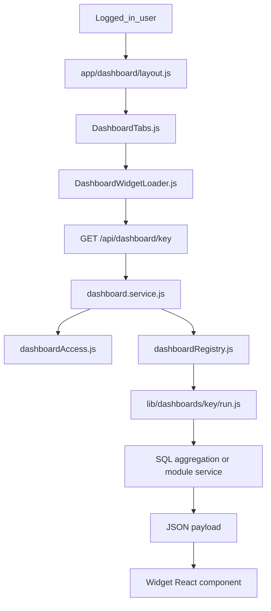

# Dashboards — guide for staff and developers

Dashboards are **at-a-glance summary panels** on the main `/dashboard` landing page. They show KPIs and charts without opening a full module screen. Numbers are loaded from the database when you open the page (or when you click **Refresh** on a widget).

---

## 1) What users see (plain English)

When you log in and open **Dashboard** (home), you may see one or more widgets in a grid:

| Widget | What it tells you |
|--------|-------------------|
| **Unit Wise Recovery Target** | How much recovery your unit achieved vs its FY target — donut, bank split, KPI counts, month trend |
| **My Tasks** | Your task workload by status (pending, in progress, etc.) |
| **My Reminders** | Your upcoming personal reminders |
| **Search Bank & Branch** | Quick lookup of branch codes and names across banks |
| **Invoice Collections** | FY billed vs received invoices, pending amount, by-bank share |
| **Regional Performance** | FY settled cases — summary KPIs, loan type pie, region bars, month-wise settlement trend |

**Full-width rows:** Unit Wise Recovery Target and Regional Performance span the whole row (four panels side by side).

If you do not see a widget, an administrator must grant the matching **Dashboards** permission in **User Permissions**.

---

## 2) Permissions (who can see what)

Each dashboard has a **permission key** in `config/dashboards.js` (for example `dashboard_regional_performance`).

| Rule | Meaning |
|------|---------|
| **Admin (role 1)** | Sees all dashboards |
| **Explicit permission** | User has any access on that dashboard key in User Permissions matrix |

Dashboard permissions appear under the **Dashboards** group in the User Permissions matrix. They are **view-only** (no add/edit/delete columns).

---

## 3) How data reaches the screen



1. **Layout** checks login and builds the list of dashboards this user may see.
2. **DashboardWidgetLoader** fetches `/api/dashboard/<key>` once and caches the result in the browser. Landing widgets **stay mounted** (hidden) while module tabs are open, so closing a tab does not reload charts — only **Refresh** or a new login triggers refetch.
3. **API** checks session + permission, then calls the matching **runner** in `lib/dashboards/<key>/run.js`.
4. **Runner** loads FY bounds, unit scope, and runs SQL (or task/reminder services).
5. **Widget component** draws charts and KPI cards from the JSON.

Click **Refresh** on a widget header to force a new fetch (bypasses cache).

---

## 4) Financial year and unit scope

Many KPI dashboards use the **active financial year** from `financial_year_master` (`lib/dashboards/loadActiveFinancialYear.js`):

- Prefer the FY where today falls between `startDate` and `endDate`.
- Otherwise use the latest active FY row.

**Unit scope** (`lib/dashboards/invoice_collections/resolveUnitScope.js` — shared by Invoice Collections and Regional Performance):

| User | Data scope |
|------|------------|
| Admin | All active units |
| Unit operator (role 2+) | Only their assigned unit |
| No unit assigned | Empty widget with a friendly message |

Unit Wise Recovery Target uses similar rules inside its own `run.js`.

---

## 5) Each dashboard — data rules (developer reference)

### Unit Wise Recovery Target

- **Folder:** `lib/dashboards/unit_wise_recovery_target/run.js`
- **UI:** `components/dashboards/unit_wise_recovery_target/UnitWiseRecoveryTargetWidget.js`
- **Recovery amount:** Sum of `new_case_inward_amount_recovered.recoveredAmount` where `recoveredDate` is in active FY.
- **Month chart:** Groups by recovery date month (when cash was recovered).

### Invoice Collections

- **Folder:** `lib/dashboards/invoice_collections/`
- **UI:** `components/dashboards/invoice_collections/InvoiceCollectionsWidget.js`
- **Sources:** Recovery, SARFAESI, and Vehicle invoice tables (see `invoiceSources.js`).
- **KPIs:** Billed, received, outstanding, TDS, collection %, pending count/amount.
- **Right panel:** By-bank pie (share of billed amount).

### Regional Performance

- **Folder:** `lib/dashboards/regional_performance/`
- **UI:** `components/dashboards/regional_performance/RegionalPerformanceWidget.js`
- **Cases included:** Final settled statuses (excluding Returned), `caseStatusUpdatedDate` in active FY, lifetime cash recovered > 0.
- **Panels:** Summary KPIs | loan **type** pie | RBO region bars | month-wise settled (by settlement date).
- **Note:** Month chart uses **settlement date**, not recovery date — complementary to Recovery Target.

### Search Bank & Branch

- **Folder:** `lib/dashboards/search_bank_branch/`
- **UI:** `components/dashboards/search_bank_branch/SearchBankBranchWidget.js`
- **Search API:** `GET /api/dashboard/search-bank-branch/search?q=...`

### My Tasks / My Reminders

- **Folders:** `lib/dashboards/my_tasks/run.js`, `lib/dashboards/my_reminders/run.js`
- **Services:** `lib/modules/taskDashboard.service.js`, `lib/modules/reminderDashboard.service.js`
- **UI:** `components/task/MyTasksWidget.js`, `components/reminder/MyRemindersWidget.js`

---

## 6) Shared UI building blocks

| Component | Role |
|-----------|------|
| `DashboardWidgetRefreshHeader` | Title, FY subtitle, “Updated …”, refresh button |
| `DashboardSectionHeader` | Small title inside each sub-panel |
| `DashboardWidgetLoader` | Fetch, cache, skeleton, route to the right widget |
| `BankRecoveryPie` | Reusable pie chart (banks or loan types) |
| `MonthWiseRecoveryBars` | Column chart for month-wise amounts |
| `RecoveryKpiStrip` | Compact KPI list for recovery widget |

Layout CSS for four-panel widgets: `dashboard-recovery-layout` in `app/globals.css`.

---

## 7) File map (where to edit)

Each function in these files should have a short plain-English comment (what it does, when it runs). See [CODE-COMMENTS.md](CODE-COMMENTS.md) § Inline comments.

| What you want | File |
|---------------|------|
| Add/remove a dashboard, title, permission key | `config/dashboards.js` |
| Wire runner to config key | `lib/dashboards/dashboardRegistry.js` |
| Permission logic | `lib/dashboards/dashboardAccess.js` |
| API entry point | `app/api/dashboard/[key]/route.js` |
| Landing grid + full-width slots | `components/DashboardTabs.js` |
| Map key → React widget | `components/dashboards/DashboardWidgetLoader.js` |
| SQL / aggregation for one dashboard | `lib/dashboards/<key>/` |
| Widget layout and charts | `components/dashboards/<key>/` |
| User Permissions matrix rows | `lib/rbacMatrixDashboards.js` (reads config) |
| Tests | `tests/jest/dashboard*.test.js` |

Full comment conventions: [CODE-COMMENTS.md](CODE-COMMENTS.md).

---

## 8) Adding a new dashboard (checklist)

1. Add entry to `config/dashboards.js` (`key`, `permissionKey`, `title`, `landingWidget: true`, …).
2. Create `lib/dashboards/<key>/run.js` exporting `loadDashboard(user)`.
3. Register import in `lib/dashboards/dashboardRegistry.js`.
4. Create widget under `components/dashboards/<key>/`.
5. Add branch in `components/dashboards/DashboardWidgetLoader.js`.
6. If full-width, extend `DashboardTabs.js` slot class condition.
7. Add Jest test in `tests/jest/dashboard<Key>.test.js`.
8. Grant permission in User Permissions for test users.

---

## 9) API

| Route | Purpose |
|-------|---------|
| `GET /api/dashboard/<key>` | Load widget JSON (session + dashboard permission required) |
| `GET /api/dashboard/search-bank-branch/search?q=` | Branch search for Search Bank & Branch widget |
| `GET /api/dashboard/weather` | Topbar weather (not a landing widget) |

Successful response shape:

```json
{
  "ok": true,
  "key": "regional_performance",
  "financialYear": { "yearCode": "2025-26", "yearRangeLabel": "Apr 2025 – Mar 2026" },
  "...": "dashboard-specific fields"
}
```

---

## 10) Tests

Run dashboard tests:

```bash
npx jest tests/jest/dashboardRegionalPerformance.test.js
npx jest tests/jest/dashboardInvoiceCollections.test.js
npx jest tests/jest/dashboardUnitWiseRecoveryTarget.test.js
npx jest tests/jest/dashboardSearchBankBranch.test.js
npx jest tests/jest/rbacMatrixDashboards.test.js
```

Tests mock the database and verify config registration, SQL shape, and permission keys.
